# 🔒 Sovereign AI Workbench
## System Architecture & Technical Documentation

> **Project:** Smart India Hackathon (SIH) 2026 — Problem Statement 26117  
> **Target Environment:** On-Premise, Air-Gapped Industrial Facility (MRPL Refinery)  
> **System Nature:** Self-Hosted, Privacy-Preserving Agentic AI Workbench  
> **Source of Truth:** Current Repository Implementation (`Master/`)  
> **Documentation Date:** September 2026  

---

## Table of Contents

1. [System Overview & Core Concept](#1-system-overview--core-concept)
2. [Current System Architecture](#2-current-system-architecture)
3. [Component Architecture Deep-Dive](#3-component-architecture-deep-dive)
4. [Frontend Architecture](#4-frontend-architecture)
5. [Backend Architecture](#5-backend-architecture)
6. [Frontend ↔ Backend Integration & API Contracts](#6-frontend--backend-integration--api-contracts)
7. [Complete End-to-End Workflow](#7-complete-end-to-end-workflow)
8. [File Upload & Document Processing Pipeline](#8-file-upload--document-processing-pipeline)
9. [OCR & Document Extraction Architecture](#9-ocr--document-extraction-architecture)
10. [AI / Agent Routing & Tool Execution Workflow](#10-ai--agent-routing--tool-execution-workflow)
11. [Data Storage & Memory Hierarchy](#11-data-storage--memory-hierarchy)
12. [Deployment & Air-Gap Architecture](#12-deployment--air-gap-architecture)
13. [Architecture Table](#13-architecture-table)
14. [Workflow Execution Table](#14-workflow-execution-table)
15. [System Mermaid Diagrams & Flowcharts](#15-system-mermaid-diagrams--flowcharts)
    * [15.1 Flowchart: Technical Architecture & Technology Stack](#151-flowchart-technical-architecture--technology-stack)
    * [15.2 Flowchart: Master End-to-End System Workflow](#152-flowchart-master-end-to-end-system-workflow)
    * [15.3 Code-Level Flowcharts (Flowcharts of All Modules)](#153-code-level-flowcharts-flowcharts-of-all-modules)
        * [15.3.1 start.py — Boot & Environment Verification Flowchart](#1531-startpy--boot--environment-verification-flowchart)
        * [15.3.2 api_server.py — Request Lifecycle & API Router Flowchart](#1532-api_serverpy--request-lifecycle--api-router-flowchart)
        * [15.3.3 core/orchestrator.py & model_registry.py — Task Routing Pipeline](#1533-coreorchestratorpy--model_registrypy--task-routing-pipeline)
        * [15.3.4 core/agent.py — Autonomous ReAct Deliberation Loop](#1534-coreagentpy--autonomous-react-deliberation-loop)
        * [15.3.5 core/rag.py — Vector Ingestion & Similarity Search Flowchart](#1535-coreragpy--vector-ingestion--similarity-search-flowchart)
        * [15.3.6 core/sandbox.py & code_inspector.py — Safe Code Execution Pipeline](#1536-coresandboxpy--code_inspectorpy--safe-code-execution-pipeline)
        * [15.3.7 core/doc_gen.py — Report Generation Pipeline Flowchart](#1537-coredoc_genpy--report-generation-pipeline-flowchart)
        * [15.3.8 OCR/file_processor.py — Multi-Format File Extraction Flowchart](#1538-ocrfile_processorpy--multi-format-file-extraction-flowchart)
        * [15.3.9 frontend/js/ — Client State, Auth & Dispatch Flowchart](#1539-frontendjs--client-state-auth--dispatch-flowchart)
    * [15.4 Diagram 1 — High-Level System Architecture](#154-diagram-1--high-level-system-architecture)
    * [15.5 Diagram 2 — Frontend ↔ Backend Architecture](#155-diagram-2--frontend--backend-architecture)
    * [15.6 Diagram 3 — End-to-End User Interaction Sequence](#156-diagram-3--end-to-end-user-interaction-sequence)
    * [15.7 Diagram 4 — File Upload & Ingestion Pipeline](#157-diagram-4--file-upload--ingestion-pipeline)
    * [15.8 Diagram 5 — AI Agent Routing & Execution Loop](#158-diagram-5--ai-agent-routing--execution-loop)
    * [15.9 Diagram 6 — OCR & Multi-Format Parsing Pipeline](#159-diagram-6--ocr--multi-format-parsing-pipeline)
    * [15.10 Diagram 7 — Deployment & Air-Gap Topology](#1510-diagram-7--deployment--air-gap-topology)
16. [Known Gaps & Future Roadmap](#16-known-gaps--future-roadmap)

---

## 1. System Overview & Core Concept

### 1.1 What the System Does
The **Sovereign AI Workbench** is a zero-egress, air-gapped agentic AI system engineered to operate inside strictly isolated industrial control and corporate environments. It allows engineers and operators to query technical documentation, inspect operating parameters against equipment manuals, extract structured intelligence from complex files (PDFs, Word documents, Excel sheets, and CSVs), execute sandboxed data analysis scripts, and automatically author technical Word reports without sending any data over external networks.

### 1.2 Main Purpose
* **Eliminate Data Exfiltration Risk:** Guarantees zero external network egress (0 Bytes outbound), strictly enforcing on-premise computation.
* **Autonomous Task Solving:** Orchestrates multi-step reasoning using autonomous AI agents equipped with tool calling (knowledge base retrieval, isolated code execution, and technical report drafting).
* **Industrial Document Intelligence:** Provides multi-format document parsing and OCR extraction to ingest plant manuals, work order histories, and inspection scans into local vector memory.

### 1.3 High-Level Working Concept

```text
User / Operator
       │ (Interacts via Web Browser)
       ▼
Frontend (HTML5 / Vanilla CSS / ES6 JavaScript)
       │ (REST API calls over HTTP / JSON / Multipart)
       ▼
Backend API Server (FastAPI / Uvicorn — api_server.py)
       │ (Dispatches requests to Core Orchestration)
       ▼
Core Orchestrator (core/orchestrator.py)
  ├── Task Classifier (Task Type: Reasoning / Coding / Vision)
  ├── Model Registry (Binds to local Ollama instance: qwen3-vl:4b)
  └── Agent Execution Loop (core/agent.py — Max 6 steps)
         │
         ├──► Tool 1: Vector Search (core/rag.py + sqlite-vec)
         ├──► Tool 2: Sandboxed Python Execution (core/sandbox.py)
         └──► Tool 3: Technical DOCX Generation (core/doc_gen.py)
       │
       ▼
Response Aggregation & Audit Logging (memory/audit_log.jsonl)
       │
       ▼
Frontend UI Rendering (Answer, Confidence, Step Trace, Citations, Reports)
```

---

## 2. Current System Architecture

The application is structured into decoupled, specialized layers designed for local execution:

```text
┌─────────────────────────────────────────────────────────────────────────────┐
│                             PRESENTATION LAYER                              │
│  frontend/ (login.html, dashboard.html, workbench.html, documents.html, etc.)│
│  static/ (index.html, style.css) | Legacy UI: app.py (Streamlit)            │
└──────────────────────────────────────┬──────────────────────────────────────┘
                                       │ HTTP / JSON / Multipart-Form
                                       ▼
┌─────────────────────────────────────────────────────────────────────────────┐
│                            API & ROUTING LAYER                              │
│  api_server.py (FastAPI App, CORS Middleware, StaticFiles Mount at '/')     │
│  REST Endpoints: /auth/*, /dashboard, /documents, /chat, /reports, /agents  │
└──────────────────────────────────────┬──────────────────────────────────────┘
                                       │ Python Function Invocations
                                       ▼
┌─────────────────────────────────────────────────────────────────────────────┐
│                        CORE AGENTIC ORCHESTRATION                           │
│  core/orchestrator.py (Task Classifier, Agent Lifecycle, Audit Logger)       │
│  core/agent.py (Autonomous Agent Loop, Tool Call Dispatcher, JSON Extractor)│
│  core/model_registry.py (Runtime Model Discovery, Capability Mapper)        │
│  core/config.py (RAM Budget Ladder, Sandbox Limits, Model Mappings)         │
└──────────────┬───────────────────────┬───────────────────────┬──────────────┘
               │                       │                       │
               ▼                       ▼                       ▼
┌──────────────────────┐┌──────────────────────┐┌──────────────────────┐
│  KNOWLEDGE & MEMORY  ││  EXECUTION & TOOLS   ││   OCR & EXTRACTION   │
│  core/rag.py         ││  core/sandbox.py     ││  OCR/file_processor  │
│  core/memory_manager ││  core/code_inspector ││  OCR/document_pipeln │
│  sqlite-vec + SQLite ││  core/doc_gen.py     ││  pypdf, python-docx  │
│  memory/workbench.db ││  Isolated Subprocess ││  pandas, openpyxl    │
└──────────────────────┘└──────────────────────┘└──────────────────────┘
               │                       │                       │
               └───────────────────────┼───────────────────────┘
                                       ▼
┌─────────────────────────────────────────────────────────────────────────────┐
│                           LOCAL RUNTIME & STORAGE                           │
│  Ollama Inference Engine (Serving 'qwen3-vl:4b' locally on 127.0.0.1:11434) │
│  Filesystem Storage: data/uploads/, data/reports/, data/*.json              │
│  Audit Trail: memory/audit_log.jsonl                                        │
└─────────────────────────────────────────────────────────────────────────────┘
```

---

## 3. Component Architecture Deep-Dive

### 3.1 Frontend Service (`frontend/js/mock-api.js` / `SovereignAPI`)
* **Location:** `frontend/js/mock-api.js` (aliased as `window.SovereignAPI` and `window.MockAPI`)
* **Purpose:** Single-point HTTP client abstraction for all frontend views. All simulated mock responses and timer delays have been removed; every call communicates with the real FastAPI backend.
* **Input:** JavaScript function parameters (credentials, chat messages, file buffers, filter objects).
* **Processing:** Marshals JSON payloads and `FormData` multipart streams; performs `fetch()` calls to `API_BASE` (`http://localhost:8000`); parses JSON/Blob responses; updates browser `localStorage` and `sessionStorage`.
* **Output:** Promise resolving to backend data or rejecting with standard Error objects.
* **Dependencies:** Browser Fetch API, `URL.createObjectURL`, `sessionStorage`, `localStorage`.

### 3.2 Unified API Server (`api_server.py`)
* **Location:** `api_server.py`
* **Purpose:** Primary application gateway. Hosts the full REST API, integrates core agent capabilities, manages persistence, and statically serves the entire HTML/CSS/JS frontend on port 8000.
* **Input:** HTTP requests (JSON bodies, query strings, multipart file streams).
* **Processing:** Route dispatching, file persistence to `data/uploads/`, text extraction via `OCR.file_processor`, vector ingestion via `core.rag.ingest_text`, agent execution via `core.orchestrator.run_agent`, report generation via `core.doc_gen.generate_docx`, audit log recording.
* **Output:** HTTP JSON responses, file streams (`FileResponse`), static web assets.
* **Dependencies:** `fastapi`, `uvicorn`, `starlette`, `pydantic`.

### 3.3 Core Orchestrator (`core/orchestrator.py`)
* **Location:** `core/orchestrator.py`
* **Purpose:** Manages the lifecycle of an AI task. Classifies user intent, selects available models, instantiates the autonomous `Agent`, executes tools, and logs audit events.
* **Input:** `prompt: str`, `project_id: str`, `image_path: Optional[str]`, `persona: str`.
* **Processing:** 
  1. Calls `classify_task()` to classify query into `"coding"`, `"vision"`, or `"reasoning"`.
  2. Resolves active model name via `core.model_registry.get_best_model()`.
  3. Registers tool instances (`search_knowledge_base`, `generate_docx`, `execute_code`).
  4. Runs `Agent.run()`.
  5. Records chat turn in vector database memory via `add_chat_memory()`.
  6. Writes audit record via `_write_audit_log()`.
* **Output:** Result dictionary containing `result`, `reasoning`, `confidence`, `status`, `trace`, and `sources`.
* **Dependencies:** `core.agent`, `core.model_registry`, `core.rag`, `core.doc_gen`, `core.sandbox`, `ollama`.

### 3.4 Agent Execution Engine (`core/agent.py`)
* **Location:** `core/agent.py`
* **Purpose:** ReAct-style autonomous agent that reasons and calls tools iteratively until task completion.
* **Input:** User task string, list of `Tool` objects, maximum steps (`max_steps=6`).
* **Processing:** Prompt synthesis with tool documentation, raw model inference call, JSON decision extraction via regex/json parser, tool execution dispatch, deduplication of failed tool calls, step tracing.
* **Output:** Structured dictionary `{ "result": str, "reasoning": str, "confidence": str, "trace": list, "status": "completed" | "incomplete" }`.
* **Dependencies:** `json`, `re`, `dataclasses`.

### 3.5 Model Registry (`core/model_registry.py`)
* **Location:** `core/model_registry.py`
* **Purpose:** Runtime discovery and capability mapping for local Ollama models ("Bring Your Own Model" / BYOM architecture).
* **Input:** Inquiries for capabilities (`"coding"`, `"vision"`, `"reasoning"`, `"general"`).
* **Processing:** Calls `ollama.list()`; normalizes object/dictionary representations; checks names against keyword heuristics (`coder`, `vision`, `vl`, `llama`, `qwen`); falls back to available general models or the first active model.
* **Output:** Tuple of `(model_name: str | None, warning: str | None)`.
* **Dependencies:** `ollama`.

### 3.6 Retrieval-Augmented Generation & Vector Memory (`core/rag.py`)
* **Location:** `core/rag.py`
* **Purpose:** Chunks, embeds, stores, and semantically retrieves text and code passages in SQLite using the `sqlite-vec` vector extension.
* **Input:** Text strings, source identifiers, search queries.
* **Processing:**
  * **Embedding Generation:** Queries local Ollama embedding model (`nomic-embed-text`); if unavailable, falls back to a deterministic 768-dimensional local vector embedding algorithm to ensure continuous offline operation.
  * **Storage:** Stores text in table `chunks`, packs float vectors into binary blobs, and indexes them in virtual table `vec_chunks USING vec0(embedding float[768])`.
  * **Retrieval:** Executes vector k-NN query `WHERE vec_chunks.embedding MATCH ? AND k = ?`, joins against metadata, and returns sorted distance matches.
* **Output:** Chunks inserted count, or list of ranked citations with similarity distances.
* **Dependencies:** `sqlite3`, `sqlite-vec`, `ollama`, `struct`, `hashlib`, `math`.

### 3.7 Sandboxed Code Execution (`core/sandbox.py` & `core/code_inspector.py`)
* **Location:** `core/sandbox.py`, `core/code_inspector.py`
* **Purpose:** Multi-layer security jail for executing LLM-generated Python scripts safely.
* **Security Layers:**
  1. **AST Import Inspection:** Parses abstract syntax tree; blocks `os`, `sys`, `subprocess`, `socket`, `shutil`, `pty`, `eval`, `exec`.
  2. **Filesystem Confinement:** Copies code into temporary directory `sandbox_jail_*` away from workspace root and database files.
  3. **OS Kernel Limits:** Enforces `RLIMIT_AS` (RAM cap) and `RLIMIT_CPU` (CPU time) via `preexec_fn` on Unix (guarded on Windows).
  4. **Subprocess Timeout:** Strict wall-clock execution limit (`subprocess.run(timeout=5)`).
* **Output:** Execution dictionary `{ "success": bool, "output": str, "error": str }`.
* **Dependencies:** `ast`, `subprocess`, `tempfile`, `shutil`.

### 3.8 Document Processing & OCR (`OCR/file_processor.py` & `OCR/document_pipeline.py`)
* **Location:** `OCR/file_processor.py`, `OCR/document_pipeline.py`
* **Purpose:** Extracts raw text from diverse enterprise file formats.
* **Supported Formats:** PDF (`pypdf.PdfReader`), Word (`docx.Document`), Excel (`pandas.read_excel`), CSV (`pandas.read_csv`), Text (`open(..., errors='ignore')`), Images (`OCR/paddleocr_test.py` via PaddleOCR).
* **Output:** Clean string containing extracted document text with page/sheet markers.
* **Dependencies:** `pypdf`, `python-docx`, `pandas`, `openpyxl`.

### 3.9 Document Report Generation (`core/doc_gen.py`)
* **Location:** `core/doc_gen.py`
* **Purpose:** Transforms Markdown analysis output into standardized Word `.docx` technical documents.
* **Processing:** Attempts formatting via Pandoc CLI; if Pandoc is missing, automatically falls back to an embedded `python-docx` parser that maps markdown headings, lists, and paragraphs to native Word styles.
* **Output:** `ToolResult(ok=True, output="/path/to/report.docx")`.
* **Dependencies:** `subprocess`, `python-docx`.

---

## 4. Frontend Architecture

The frontend is a lightweight, responsive multi-page web application using modern vanilla JavaScript (ES6+), semantic HTML5, and customized CSS variables with dark mode.

### 4.1 Pages and Views

| Page | URL Path | Primary Function | Connected API Endpoints |
|:-----|:---------|:-----------------|:------------------------|
| **Entry Redirect** | `/` (`index.html`) | Authenticates session and routes user | Local storage check → `login.html` / `dashboard.html` |
| **Login** | `/login.html` | Operator/Admin authentication | `POST /auth/login` |
| **Dashboard** | `/dashboard.html` | High-level operations, health, metrics | `GET /dashboard` |
| **AI Workbench** | `/workbench.html` | Main agent chat, attachments, trace | `POST /chat`, `GET /chat/sources`, `POST /documents` |
| **Documents** | `/documents.html` | Repository file inventory, upload, preview | `GET /documents`, `POST /documents`, `DELETE /documents/{id}` |
| **Knowledge Bases** | `/knowledge-bases.html` | Vector collection metrics and re-indexing | `GET /knowledge-bases`, `POST /knowledge-bases/reindex` |
| **Agents** | `/agents.html` | Agent registry and model status | `GET /agents` |
| **Reports** | `/reports.html` | Technical DOCX report repository | `GET /reports`, `GET /reports/{id}/download` |
| **Audit Logs** | `/audit-logs.html` | Tamper-evident operational audit trail | `GET /audit-logs` |
| **Security Center** | `/security.html` | Air-gap status, network egress monitor | `GET /security/status` |
| **Settings** | `/settings.html` | Profile, theme, session memory purge | `DELETE /session/{id}`, `POST /settings` |

### 4.2 JavaScript Module Roles
* `frontend/js/app.js`: Application layout manager, sidebar renderer, accessible modal dialog controller, toast notification dispatcher.
* `frontend/js/auth.js`: RBAC role navigation mapping (`Admin`, `AI/ML Engineer`, `Operator`, `Viewer`), route guard redirection.
* `frontend/js/workbench.js`: Chat stream renderer, file dropzone binder, thinking state spinner, execution trace updater, industrial comparison table generator.
* `frontend/js/trace.js`: Dynamic step-by-step progress visualizer displaying live execution status (`waiting`, `running`, `success`, `failed`).
* `frontend/js/upload.js`: Drag-and-drop file ingestion handler utilizing `FormData` streams.
* `frontend/js/session.js`: Client-side session and chat message persistence manager.

---

## 5. Backend Architecture

The backend is built as an asynchronous service powered by **FastAPI** and executed on **Uvicorn**.

### 5.1 Application Entry Points
1. **Primary Unified Server (`start.py`):**
   * Verifies local prerequisites (Ollama, Pandoc).
   * Probes Ollama for local models (`qwen3-vl:4b`).
   * Starts `uvicorn api_server:app --host 127.0.0.1 --port 8000 --reload`.
   * Automatically opens the default browser to `http://127.0.0.1:8000/`.
2. **Direct CLI API Server (`api_server.py`):**
   * Executed via `uvicorn api_server:app --port 8000`.
3. **Legacy Interface (`app.py`):**
   * Streamlit-based graphical user interface for quick debugging (`streamlit run app.py`).
4. **Containerized Entry (`start_docker.py`):**
   * Boots the application inside a hardened Docker container using `docker-compose.yml`.

### 5.2 Complete REST API Surface

```text
Authentication:
  POST   /auth/login               Verify credentials, return profile
  POST   /auth/logout              Terminate user session
  GET    /users/me                 Get current user profile

System & Operations:
  GET    /dashboard                Live system status, active models, metrics
  GET    /security/status          Air-gap status, 0 network egress verification
  GET    /audit-logs               Query tamper-evident audit records (JSONL)

Document & Knowledge Management:
  GET    /documents                List all indexed documents
  POST   /documents                Upload file (Multipart), extract, index into vector DB
  GET    /documents/{doc_id}       Fetch extracted text content of a document
  DELETE /documents/{doc_id}       Remove document metadata and index
  GET    /knowledge-bases          List knowledge base collections and chunk stats
  POST   /knowledge-bases/reindex  Trigger vector index rebuild over repository files

Agent & Chat:
  POST   /chat                     Execute ReAct agent workflow on query
  GET    /chat/sources             Retrieve citations and source passages
  GET    /agents                   List registered agents, roles, and bound models
  GET    /agents/runs/{run_id}     Get step trace for a specific agent execution

Reports & Session:
  GET    /reports                  List generated Word (.docx) reports
  POST   /reports                  Generate new technical DOCX report
  GET    /reports/{id}/download    Download binary DOCX file
  DELETE /session/{session_id}     Wipe session-specific memory database

Static Assets:
  GET    /*                        Static mount serving frontend/ HTML, CSS, JS
```

---

## 6. Frontend ↔ Backend Integration & API Contracts

Every frontend interaction maps to an explicit backend API contract:

| Frontend View / Component | HTTP | Endpoint | Request Payload | Response Contract | Backend Function |
|:---|:---|:---|:---|:---|:---|
| `login.html` (Form Submit) | `POST` | `/auth/login` | `{"username": "...", "password": "...", "remember": bool}` | `{"ok": true, "user": {...}}` | `login()` |
| `app.js` (Sign Out) | `POST` | `/auth/logout` | None | `{"ok": true}` | `logout()` |
| `dashboard.js` (Init) | `GET` | `/dashboard` | None | `{"systemStatus": "OPERATIONAL", "activeAgents": 8, "documentsIndexed": int, ...}` | `get_dashboard()` |
| `workbench.js` (Send Button) | `POST` | `/chat` | `{"message": "...", "attachments": ["..."], "session_id": "..."}` | `{"result": "...", "reasoning": "...", "confidence": "high", "trace": [...], "sources": [...]}` | `chat()` |
| `workbench.js` (Citations) | `GET` | `/chat/sources` | None | `[{"id": "...", "title": "...", "page": "...", "excerpt": "..."}]` | `get_chat_sources()` |
| `upload.js` (Dropzone) | `POST` | `/documents` | `FormData: file=<binary>` | `{"id": "doc_...", "name": "...", "type": "PDF", "status": "Indexed", "size": "..."}` | `upload_document()` |
| `documents.js` (Init) | `GET` | `/documents` | None | `[{"id": "...", "name": "...", "type": "...", "status": "...", "size": "..."}]` | `get_documents()` |
| `documents.js` (Preview) | `GET` | `/documents/{id}` | Path param | `{"id": "...", "name": "...", "content": "..."}` | `get_document_content()` |
| `documents.js` (Delete) | `DELETE` | `/documents/{id}` | Path param | `{"ok": true}` | `delete_document()` |
| `knowledge-bases.js` (Init) | `GET` | `/knowledge-bases` | None | `[{"id": "...", "name": "...", "documents": int, "quality": int}]` | `get_knowledge_bases()` |
| `knowledge-bases.js` (Reindex) | `POST` | `/knowledge-bases/reindex`| None | `{"ok": true, "chunks": int}` | `reindex_kb()` |
| `agents.js` (Init) | `GET` | `/agents` | None | `[{"id": "...", "name": "...", "status": "Ready", "description": "..."}]` | `get_agents()` |
| `reports.js` (Init) | `GET` | `/reports` | None | `[{"id": "...", "name": "...", "file": "...", "generated": "..."}]` | `get_reports()` |
| `reports.js` (Download) | `GET` | `/reports/{id}/download` | Path param | File Stream (`application/vnd.openxmlformats-...`) | `download_report()` |
| `audit-logs.js` (Filter) | `GET` | `/audit-logs` | Query: `?query=...&status=...` | `[{"id": "...", "displayTime": "...", "user": "...", "action": "...", "status": "..."}]` | `get_audit_logs()` |
| `security.js` (Init) | `GET` | `/security/status` | None | `{"onPremise": true, "airGapped": true, "networkEgress": 0, "events": [...]}` | `get_security_status()` |
| `settings.js` (Clear Memory) | `DELETE` | `/session/{id}` | Path param | `{"ok": true, "message": "Session memory cleared."}` | `delete_session()` |

---

## 7. Complete End-to-End Workflow

When an industrial user interacts with the system, data flows through the following sequential path:

```text
[1. STARTUP]
start.py checks Ollama & Pandoc → Probes model 'qwen3-vl:4b' → Starts Uvicorn server on port 8000
    │
[2. INITIALIZATION]
api_server.py loads data/documents.json → Indexes OCR/input/ files if first boot → Mounts frontend/ at '/'
    │
[3. AUTHENTICATION]
User opens http://127.0.0.1:8000/ → Redirected to login.html → Submits admin / admin123
POST /auth/login verifies credentials against data/users.json → Returns token and user object
Session saved in sessionStorage → User routed to dashboard.html or workbench.html
    │
[4. QUERY SUBMISSION]
User types in workbench.html: "Analyze bearing temperature on Unit C-204" (optional image attached)
workbench.js updates UI state to "THINKING" → Dispatches POST /chat payload to api_server.py
    │
[5. SECURITY SCREENING]
api_server.py validates payload → Scans for data exfiltration phrases / external URL patterns
If clean, logs audit event to memory/audit_log.jsonl and invokes run_agent()
    │
[6. AGENT TASK CLASSIFICATION & MODEL BINDING]
core/orchestrator.py calls classify_task() → Routes to "reasoning" (or "vision" if image attached)
model_registry.py binds task to local model 'qwen3-vl:4b' running on Ollama
    │
[7. REACT AGENT EXECUTION LOOP (Max 6 Steps)]
core/agent.py builds ReAct prompt with tool schemas
Calls Ollama generate() API on 127.0.0.1:11434
Model emits structured decision:
  -> If {"action": "call_tool", "tool": "search_knowledge_base", "arg": "C-204 bearing threshold"}
     Tool executes core/rag.py search() query against memory/workbench.db (sqlite-vec)
     Returns matched SOP text excerpts to Agent history
  -> Model processes retrieved evidence, computes comparison, and decides to finish:
     Emits {"action": "finish", "result": "Bearing operating at 82C exceeds 75C limit...", "confidence": "high"}
    │
[8. MEMORY CONSOLIDATION & AUDIT]
Interaction stored in memory/workbench.db as chat chunk
core/memory_manager.py checks if threshold exceeded (every 50 messages) to auto-summarize
Audit log record written to memory/audit_log.jsonl
    │
[9. RESPONSE RENDERING]
Backend returns JSON response to workbench.js
workbench.js hides spinner → Renders formatted AI Answer → Updates Confidence Badge (HIGH)
Applies live Step Trace (Steps 1-3) → Displays clickable Source Citation chips
```

---

## 8. File Upload & Document Processing Pipeline

The file upload workflow processes binary files into searchable vector chunks:

```text
[FRONTEND]
User drops file (PDF, DOCX, CSV, Excel, Image) onto Dropzone in workbench.html or documents.html
upload.js wraps binary file into FormData and invokes POST /documents
    │
[BACKEND RECEPTION]
api_server.py receives stream via FastAPI UploadFile
Validates extension → Writes raw binary to data/uploads/<filename>
Computes human-readable file size and metadata
    │
[CONTENT EXTRACTION]
api_server.py branches extraction based on file extension:
  ├── Text / Markdown / Code / JSON: Read directly with UTF-8 encoding
  ├── PDF / DOCX / CSV / Excel: Processed via OCR.file_processor.process_file()
  │     ├── PDF: pypdf extracts text per page with page headers
  │     ├── DOCX: python-docx extracts paragraph text
  │     ├── CSV / Excel: pandas converts sheets/tables into structured text strings
  └── PNG / JPG / JPEG: Preserved on disk for Multimodal Vision Agent (qwen3-vl:4b)
    │
[CHUNKING & VECTOR EMBEDDING]
Extracted text dispatched to core.rag.ingest_text():
Text is split into semantic paragraphs (>40 chars)
Each chunk is converted into an embedding vector:
  -> Queries Ollama nomic-embed-text
  -> If model missing: executes deterministic 768-dim local vector generator
Chunk text is stored in SQLite table 'chunks' (source_type = 'doc')
Vector is packed into float32 binary blob and stored in 'vec_chunks' (sqlite-vec)
    │
[METADATA PERSISTENCE & AUDIT]
Document metadata added to data/documents.json
Audit entry recorded in memory/audit_log.jsonl: "Document uploaded and ingested"
    │
[FRONTEND UPDATE]
Backend returns 200 OK with document record JSON
Frontend documents table refreshes automatically with new row (Status: "Indexed")
```

---

## 9. OCR & Document Extraction Architecture

The OCR subsystem handles textual extraction from scanned documents, multi-page PDFs, spreadsheets, and technical images.

### 9.1 Architecture & Components
* **Module:** `OCR/file_processor.py` (supported by `OCR/document_pipeline.py` and `OCR/paddleocr_test.py`)
* **Engines:**
  * **Digital Documents:** `pypdf` (PDF extraction), `python-docx` (Word processing), `pandas` + `openpyxl` (spreadsheets).
  * **Scanned / Visual Documents:** `PaddleOCR` (English/multilingual OCR engine) and `qwen3-vl:4b` (visual layout & chart understanding).

### 9.2 OCR Processing Flow

```text
Incoming Document (e.g. Scanned Procedure, Invoice, Technical Drawing)
    │
    ▼
OCR / File Router (OCR/file_processor.py - process_file)
    │
    ├── Extension == .pdf  ──► extract_pdf() (Page-by-page text buffer)
    ├── Extension == .docx ──► extract_docx() (Paragraph & table parser)
    ├── Extension == .csv  ──► extract_csv() (Pandas table serializer)
    ├── Extension == .xlsx ──► extract_excel() (Multi-sheet table serializer)
    ├── Extension == .txt  ──► extract_text_file() (UTF-8 direct reader)
    └── Extension == image ──► PaddleOCR / Vision Model Pipeline
                                 │
                                 ▼
                     Extracted Clean Document Text
                                 │
                                 ▼
             Vector Chunking & sqlite-vec Indexing (core/rag.py)
                                 │
                                 ▼
         Searchable Knowledge Base for Sovereign AI Agent
```

---

## 10. AI / Agent Routing & Tool Execution Workflow

The system employs a dynamically routed ReAct (Reasoning + Acting) autonomous agent framework.

### 10.1 Intent Classification Matrix

| Task Type | Trigger Condition | Bound Model (Ollama) | Routing Justification |
|:---|:---|:---|:---|
| **Vision** | File attachment present with `.png`, `.jpg`, `.jpeg`, `.pdf` | `qwen3-vl:4b` | Multimodal model required to inspect component surface/damage |
| **Coding** | Prompt contains keywords: `code`, `python`, `script`, `function`, `sql`, `bug` | `qwen3-vl:4b` (fallback) / `qwen2.5-coder:1.5b` | Code generation and execution requires code-optimized model |
| **Reasoning** | General query, document question, procedural analysis | `qwen3-vl:4b` (fallback) / `llama3.2:3b` | General reasoning and knowledge synthesis |

### 10.2 Tool Ecosystem

The agent has access to 3 strictly sandboxed on-premise tools:

1. **`search_knowledge_base` (`core/orchestrator.py` → `core/rag.py`)**
   * *Purpose:* Grounded semantic search across internal manuals and indexed documents.
   * *Mechanism:* Vector k-NN query over `memory/workbench.db`. Returns verified passages with similarity distance and citation metadata.
2. **`execute_code` (`core/orchestrator.py` → `core/sandbox.py`)**
   * *Purpose:* Executes mathematical calculations, statistical models, and data transforms.
   * *Mechanism:* Writes script to isolated directory, performs AST import filtering, executes inside subprocess with strict 5-second timeout and 256MB RAM cap.
3. **`generate_docx` (`core/orchestrator.py` → `core/doc_gen.py`)**
   * *Purpose:* Creates publication-ready Word documents from analysis results.
   * *Mechanism:* Parses markdown input; generates styled Word document via Pandoc or native `python-docx`; saves to `data/reports/`.

---

## 11. Data Storage & Memory Hierarchy

All state and knowledge reside locally in plain files and embedded SQLite databases:

```text
Master/
├── data/
│   ├── documents.json         # Master list of indexed documents & file paths
│   ├── reports.json           # Catalog of all generated DOCX reports
│   ├── users.json             # On-premise user credentials & RBAC definitions
│   ├── uploads/               # Persistent raw storage of uploaded user files
│   └── reports/               # Output storage of generated .docx Word reports
│
├── memory/
│   ├── workbench.db           # SQLite database with sqlite-vec extension:
│   │                          #   - chunks: id, file_path, content, source_type, score
│   │                          #   - vec_chunks: virtual table holding float[768] vectors
│   └── audit_log.jsonl        # Append-only, tamper-evident operational audit trail
│
└── OCR/input/                 # Repository baseline documents (PDFs, sheets, images)
```

---

## 12. Deployment & Air-Gap Architecture

The application is engineered to deploy in high-security, air-gapped server environments:

### 12.1 Deployment Modes

```text
Mode 1: Native Unified Host Execution
Command: python start.py
Process: Spawns Uvicorn ASGI server binding 127.0.0.1:8000.
Services: FastAPI hosts REST API and statically serves frontend/ assets.
Inference: Connects via localhost loopback to Ollama daemon on 127.0.0.1:11434.

Mode 2: Containerized Air-Gapped Deployment
Command: python start_docker.py  (or docker compose up -d)
File: Dockerfile + docker-compose.yml
Configuration:
  - Network mode: internal / host bridge
  - Resource caps: 40% system RAM allocation
  - Volume mounts: ./data -> /app/data, ./memory -> /app/memory
  - Container isolates OS kernel from host filesystem.

Mode 3: OS Kernel Network Isolation (Linux)
Script: airgap.sh
Mechanism: Applies iptables firewall rules to drop all outbound TCP/UDP packets
except local loopback (127.0.0.1) communication with Ollama.
```

---

## 13. Architecture Table

| Component | Repository Location | Responsibility | Communicates With |
|:---|:---|:---|:---|
| **Web Frontend UI** | `frontend/*.html`, `frontend/css/*` | User interface, chat rendering, dropzone, forms | `frontend/js/mock-api.js`, Browser DOM |
| **API Client Layer** | `frontend/js/mock-api.js` | Dispatches real `fetch()` calls to backend | `api_server.py` (FastAPI REST API) |
| **Client Auth Manager** | `frontend/js/auth.js` | Enforces client-side RBAC and session checks | `sessionStorage`, `localStorage` |
| **Unified API Server** | `api_server.py` | Hosts REST API, routes requests, serves static UI | `frontend/`, `core/orchestrator.py`, `core/rag.py` |
| **Core Orchestrator** | `core/orchestrator.py` | Coordinates AI agents, classifies tasks, logs audit | `core/agent.py`, `core/model_registry.py`, `Ollama` |
| **Agent ReAct Engine** | `core/agent.py` | Multi-step agent deliberation, tool dispatch | `core/orchestrator.py`, Registered Tools |
| **Model Registry** | `core/model_registry.py` | Discovers and maps installed Ollama LLMs | `Ollama` (`http://127.0.0.1:11434`) |
| **RAG & Vector Memory** | `core/rag.py` | Chunking, embedding, vector k-NN search | `memory/workbench.db` (sqlite-vec) |
| **Memory Manager** | `core/memory_manager.py` | Consolidates and summarizes long-term memory | `core/rag.py`, `Ollama` |
| **Sandbox Execution** | `core/sandbox.py` | Runs Python scripts inside OS-confined jail | `core/code_inspector.py`, Subprocess |
| **Code Inspector** | `core/code_inspector.py` | AST analysis blocking malicious Python imports | `core/sandbox.py` |
| **Report Generator** | `core/doc_gen.py` | Compiles analysis markdown into Word `.docx` | `Pandoc` CLI, `python-docx`, Filesystem |
| **Document Extractor** | `OCR/file_processor.py` | Extracts text from PDFs, DOCX, CSVs, Excel | `pypdf`, `python-docx`, `pandas` |
| **Configuration Manager**| `core/config.py` | Computes RAM budgets and context sizes | `~/.workbench/config.json` |
| **System Launcher** | `start.py` | Verifies models and boots full system | `Uvicorn`, Web Browser |

---

## 14. Workflow Execution Table

| Step | Component / File | Action Performed | Generated Output |
|:---|:---|:---|:---|
| **1. Startup** | `start.py` | Verifies Ollama, queries `qwen3-vl:4b`, launches Uvicorn | Server listening on `http://127.0.0.1:8000` |
| **2. Client Load** | `frontend/index.html` | Checks `sessionStorage` for active auth token | Redirects to `login.html` or `dashboard.html` |
| **3. Sign In** | `frontend/js/auth.js` | Sends `POST /auth/login` with username & password | User session stored in browser memory |
| **4. Dashboard Fetch**| `api_server.py` | Queries SQLite chunk counts, document list, audit log | Returns live system health and metrics JSON |
| **5. Query Sent** | `frontend/js/workbench.js` | Dispatches `POST /chat` with query and attachment names | Initiates ReAct agent run on backend |
| **6. Task Route** | `core/orchestrator.py` | Analyzes prompt keywords and media presence | Routes task to `reasoning`, `coding`, or `vision` |
| **7. LLM Reasoning** | `core/agent.py` | Prompts local model via Ollama loopback | Emits tool call JSON or finish answer |
| **8. Vector Search** | `core/rag.py` | Matches query vector against `vec_chunks` in SQLite | Returns top-k relevant manual excerpts |
| **9. Answer Emit** | `core/agent.py` | Synthesizes retrieved evidence into final response | Completed dictionary with trace and confidence |
| **10. Audit Record** | `core/orchestrator.py` | Appends event JSON to `memory/audit_log.jsonl` | Persistent, tamper-evident audit trail |
| **11. UI Render** | `frontend/js/workbench.js` | Formats text, confidence badge, trace, and citations | Interactive response rendered in user browser |

---

## 15. System Mermaid Diagrams & Flowcharts

---

### 15.1 Flowchart: Technical Architecture & Technology Stack

The following flowchart illustrates the entire technical architecture and software stack of the Sovereign AI Workbench across all 7 layers, detailing the exact languages, frameworks, models, databases, and containment mechanisms:

```mermaid
flowchart TD
    subgraph UI_Tier ["1. Presentation & Client UI Tier"]
        direction TB
        HTML["HTML5 Semantic Templates\n(login.html, dashboard.html, workbench.html, documents.html, reports.html)"]
        CSS["Vanilla Modern CSS3\n(Glassmorphism, CSS Variables, Responsive Grid, Dark Mode)"]
        JS_CTRL["DOM View Controllers\n(workbench.js, documents.js, dashboard.js, upload.js, reports.js)"]
        JS_AUTH["Client Security & RBAC\n(auth.js -> Admin, Operator, Auditor roles)"]
        API_CLIENT["SovereignAPI HTTP Client\n(frontend/js/mock-api.js -> Fetch API, zero mock delays)"]
        HTML --- CSS --- JS_CTRL --- JS_AUTH --- API_CLIENT
    end

    subgraph API_Tier ["2. Gateway & Application Server Tier"]
        direction TB
        ASGI["Uvicorn ASGI Server\n(127.0.0.1:8000, multi-worker ready)"]
        FASTAPI["FastAPI Framework (api_server.py)\n(Async Request Pipeline, Pydantic Schemas, CORSMiddleware)"]
        STATIC_SRV["StaticFiles Mount\n(Serves frontend/ assets at root '/')"]
        ROUTERS["18 REST API Endpoints\n(/auth, /dashboard, /chat, /documents, /reports, /agents, /security)"]
        ASGI --- FASTAPI --- STATIC_SRV --- ROUTERS
    end

    subgraph Core_Tier ["3. Agentic & Cognitive Core Tier"]
        direction TB
        ORCH["Core Orchestrator (core/orchestrator.py)\n(Task Classification, Agent Lifecycle, Trace Formatting)"]
        AGENT["Autonomous ReAct Agent (core/agent.py)\n(Multi-Turn Deliberation, JSON Action Extraction, Max 6 Steps)"]
        REGISTRY["Model Registry (core/model_registry.py)\n(Dynamic Ollama API Discovery & Capability Mapping)"]
        CONFIG["System Configuration (core/config.py)\n(RAM Budgeting Ladder, Context Windows, Sandbox Limits)"]
        ORCH --- AGENT --- REGISTRY --- CONFIG
    end

    subgraph AI_Tier ["4. Local Model & Inference Tier (100% Offline)"]
        direction TB
        OLLAMA["Ollama Local Daemon (:11434)\n(C++ Llama.cpp backend, CPU/GPU acceleration, zero telemetry)"]
        LLM["qwen3-vl:4b Multimodal Model\n(3.3 GB Local Weights: Vision + Reasoning + Industrial Coding)"]
        EMBED["Vector Embedding Engine (core/rag.py)\n(Ollama nomic-embed-text OR Deterministic 768-d Vector Fallback)"]
        OLLAMA --- LLM --- EMBED
    end

    subgraph Tools_Tier ["5. Tooling & Specialized Engine Tier"]
        direction TB
        RAG_TOOL["Vector Retrieval Engine (core/rag.py)\n(Semantic Paragraph Chunking + Cosine k-NN Match)"]
        SANDBOX_TOOL["Code Execution Jail (core/sandbox.py)\n(Subprocess, Memory/CPU Limits, Isolated Temp CWD)"]
        INSPECTOR["AST Code Inspector (core/code_inspector.py)\n(AST Syntax Tree Analysis, Forbidden Import/Builtin Blocking)"]
        DOC_TOOL["Report Generator (core/doc_gen.py)\n(Pandoc Engine with python-docx Native Fallback)"]
        PARSER["Multi-Format Parser (OCR/file_processor.py)\n(pypdf, python-docx, pandas, openpyxl, PaddleOCR)"]
        RAG_TOOL --- SANDBOX_TOOL --- INSPECTOR --- DOC_TOOL --- PARSER
    end

    subgraph Storage_Tier ["6. Database & Persistence Tier"]
        direction TB
        SQLITE_VEC["SQLite with sqlite-vec (memory/workbench.db)\n(chunks Metadata Table + vec_chunks Virtual Vector Table)"]
        FS_DATA["Flat-File Persistence (data/)\n(documents.json, reports.json, users.json, uploads/)"]
        AUDIT["Immutable Audit Trail (memory/audit_log.jsonl)\n(Append-Only Operational Event Stream)"]
        SQLITE_VEC --- FS_DATA --- AUDIT
    end

    subgraph Security_Tier ["7. Security, Isolation & Deployment Tier"]
        direction TB
        BOOT["Unified Host Launcher (start.py) / Docker (Dockerfile)"]
        AIRGAP_FW["Host Kernel Firewall (airgap.sh)\niptables DROP Outbound (0 Bytes External Egress Guaranteed)"]
        BOOT --- AIRGAP_FW
    end

    UI_Tier ==>|HTTP REST / JSON / Multipart| API_Tier
    API_Tier ==>|In-Process Python Invocations| Core_Tier
    Core_Tier ==>|HTTP Loopback 127.0.0.1:11434| AI_Tier
    Core_Tier ==>|Tool Dispatch Invocations| Tools_Tier
    Tools_Tier ==>|Vector Indexing & KNN Queries| Storage_Tier
    API_Tier ==>|Read/Write Documents & Audit| Storage_Tier
    Security_Tier -.->|Secures & Confines| UI_Tier & API_Tier & Core_Tier & AI_Tier & Tools_Tier & Storage_Tier
```

---

### 15.2 Flowchart: Master End-to-End System Workflow

The following comprehensive workflow flowchart documents the complete operational journey from user authentication, document management, and chat query dispatch, through backend task routing, ReAct agent deliberation, tool invocation, and UI visualization:

```mermaid
flowchart TD
    START([User Opens Browser: http://127.0.0.1:8000]) --> LOGIN_CHECK{Authenticated Session?}
    
    %% Authentication Branch
    LOGIN_CHECK -->|No| LOGIN_PAGE[Render login.html]
    LOGIN_PAGE --> SUBMIT_AUTH[User Enters Username & Password]
    SUBMIT_AUTH --> POST_AUTH[POST /auth/login]
    POST_AUTH --> AUTH_VALID{Valid Credentials in data/users.json?}
    AUTH_VALID -->|No| AUTH_ERR[Display Error: Invalid Credentials] --> LOGIN_PAGE
    AUTH_VALID -->|Yes| SET_SESSION[Store token in sessionStorage & localStorage]
    SET_SESSION --> DASHBOARD_VIEW[Redirect to dashboard.html]
    
    LOGIN_CHECK -->|Yes| DASHBOARD_VIEW
    
    %% Dashboard Flow
    DASHBOARD_VIEW --> GET_DASH[GET /dashboard]
    GET_DASH --> DB_STATS[Query memory/workbench.db chunks + data/documents.json count + audit tail]
    DB_STATS --> RENDER_DASH[Render System Health, Total Chunks, Active Documents, Recent Audit Logs]
    
    %% User Action Branching
    RENDER_DASH --> USER_CHOICE{Operator Action}
    
    %% Document Ingestion Workflow
    USER_CHOICE -->|Upload Document| UPLOAD_FLOW[Navigate to documents.html]
    UPLOAD_FLOW --> DROP_FILE[User Drops PDF / DOCX / CSV / XLSX File]
    DROP_FILE --> POST_DOC[POST /documents Multipart Stream via upload.js]
    POST_DOC --> SAVE_RAW[api_server.py writes raw file to data/uploads/]
    SAVE_RAW --> PARSE_DOC[OCR/file_processor.py: Extract Text & Tables]
    PARSE_DOC --> CHUNK_TEXT[core/rag.py: Semantic Paragraph Chunking]
    CHUNK_TEXT --> GEN_VEC[Generate 768-d Vector via nomic-embed-text or Fallback]
    GEN_VEC --> SQLITE_INS[Insert into memory/workbench.db: chunks + vec_chunks]
    SQLITE_INS --> UPDATE_DOC_JSON[Update data/documents.json Status: Indexed]
    UPDATE_DOC_JSON --> AUDIT_DOC[Log Upload Event to memory/audit_log.jsonl]
    AUDIT_DOC --> DOCS_UPDATED[UI Refreshes Document Catalog Table]
    
    %% Chat & Workbench Workflow
    USER_CHOICE -->|Ask Technical Query| WORKBENCH_FLOW[Navigate to workbench.html]
    WORKBENCH_FLOW --> ENTER_QUERY[User Enters Prompt + Optional Image Attachment]
    ENTER_QUERY --> UI_WAIT[UI Shows 'Thinking' Animation & Initializes Trace Panel]
    UI_WAIT --> POST_CHAT[POST /chat payload: {message, session_id, attachments}]
    
    POST_CHAT --> CLASSIFY[core/orchestrator.py: classify_task]
    CLASSIFY --> ROUTE_TYPE{Task Classification}
    ROUTE_TYPE -->|Has Image| TASK_V[Task: Vision]
    ROUTE_TYPE -->|Contains Code Keywords| TASK_C[Task: Coding]
    ROUTE_TYPE -->|General Inquiry| TASK_R[Task: Reasoning]
    
    TASK_V & TASK_C & TASK_R --> MODEL_BIND[core/model_registry.py: Select qwen3-vl:4b]
    MODEL_BIND --> AGENT_INIT[Instantiate core/agent.py: Agent with Max 6 Steps]
    
    %% ReAct Agent Execution Loop
    subgraph Agent_Loop ["Autonomous ReAct Deliberation Loop (Max 6 Steps)"]
        AGENT_INIT --> PROMPT_BUILD[Assemble System Prompt + Tool Schemas + Tool History]
        PROMPT_BUILD --> LLM_CALL[POST http://127.0.0.1:11434/api/generate]
        LLM_CALL --> PARSE_JSON[Extract Action JSON from Model Response]
        PARSE_JSON --> ACTION_TYPE{Action Field}
        
        %% Tool Execution Branches
        ACTION_TYPE -->|call_tool| TOOL_NAME{Tool Name}
        
        TOOL_NAME -->|search_knowledge_base| EXEC_RAG[core/rag.py: search query]
        EXEC_RAG --> KNN_SEARCH[sqlite-vec: Cosine k-NN Match in vec_chunks]
        KNN_SEARCH --> RAG_OBS[Return Document Excerpts & File References]
        
        TOOL_NAME -->|execute_code| EXEC_CODE[core/sandbox.py: execute_code]
        EXEC_CODE --> AST_CHECK{core/code_inspector.py: AST Safe?}
        AST_CHECK -->|Violations Found| BLOCKED_OBS[Return Security Violation Error]
        AST_CHECK -->|Safe| RUN_JAIL[Run Python Subprocess in Isolated Temp Dir]
        RUN_JAIL --> CODE_OBS[Capture stdout / stderr / exec_time]
        
        TOOL_NAME -->|generate_docx| EXEC_DOC[core/doc_gen.py: generate_docx]
        EXEC_DOC --> BUILD_WORD[Compile Markdown to data/reports/*.docx via Pandoc/docx]
        BUILD_WORD --> DOC_OBS[Record in data/reports.json & Return File Path]
        
        RAG_OBS & BLOCKED_OBS & CODE_OBS & DOC_OBS --> APPEND_OBS[Append Tool Output to Tool History & Trace]
        APPEND_OBS --> STEP_INC{Steps >= 6?}
        STEP_INC -->|No| PROMPT_BUILD
        STEP_INC -->|Yes| FORCED_FINISH[Synthesize Final Response from Accumulated History]
        
        ACTION_TYPE -->|finish| EXTRACT_FIN[Extract result, confidence, reasoning]
    end
    
    EXTRACT_FIN & FORCED_FINISH --> LOG_AUDIT[core/orchestrator.py: Append Query & Trace to memory/audit_log.jsonl]
    LOG_AUDIT --> CHAT_RESP[api_server.py returns 200 OK JSON: {response, confidence, trace, sources}]
    
    CHAT_RESP --> UI_RENDER[frontend/js/workbench.js Updates DOM]
    UI_RENDER --> SHOW_ANSWER[Render Answer Markdown + Confidence Badge]
    UI_RENDER --> SHOW_TRACE[Render Step-by-Step Tool Accordion & Reasoning]
    UI_RENDER --> SHOW_SOURCES[Render Source Citations & Download Links]
    SHOW_ANSWER & SHOW_TRACE & SHOW_SOURCES --> DONE([Operator Reviews Evidence-Grounded Result])
```

---

### 15.3 Code-Level Flowcharts (Flowcharts of All Modules)

The following flowcharts document the exact internal execution flow of every primary code module in the repository:

#### 15.3.1 `start.py` — Boot & Environment Verification Flowchart

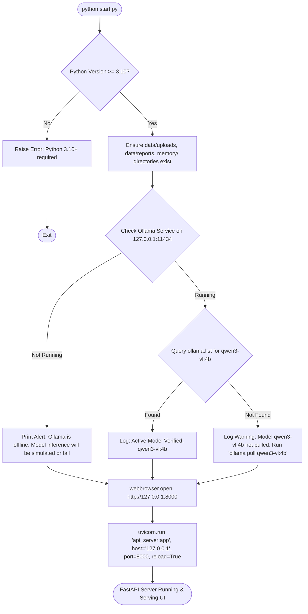

#### 15.3.2 `api_server.py` — Request Lifecycle & API Router Flowchart

```mermaid
flowchart TD
    REQ[Incoming HTTP Request] --> CORS[CORSMiddleware: Allow All Local Origins]
    CORS --> ROUTE_MATCH{URI Prefix Match}
    
    ROUTE_MATCH -->|'/' or '/static' or '*.html'| STATIC[StaticFiles Handler: Stream frontend/ assets]
    ROUTE_MATCH -->|'/auth/*'| AUTH_ROUTER{Auth Endpoint}
    AUTH_ROUTER -->|POST /auth/login| CHECK_CREDS[Validate against data/users.json -> Return Session Token]
    AUTH_ROUTER -->|POST /auth/logout| CLEAR_SESSION[Invalidate Session -> Return 200 OK]
    AUTH_ROUTER -->|GET /auth/me| CURRENT_USER[Return Active User Role & Identity]
    
    ROUTE_MATCH -->|'/dashboard'| DASH_ROUTER[Query chunks count from memory/workbench.db + documents + audit tail]
    
    ROUTE_MATCH -->|'/documents'| DOCS_ROUTER{Documents Method}
    DOCS_ROUTER -->|GET /documents| LIST_DOCS[Read data/documents.json -> Return Array]
    DOCS_ROUTER -->|POST /documents| UPLOAD_DOC[Save binary to data/uploads/ -> Parse & Ingest -> Return Indexed Document]
    DOCS_ROUTER -->|GET /documents/{id}| GET_DOC[Read extracted text from DB/filesystem -> Return Content]
    DOCS_ROUTER -->|DELETE /documents/{id}| DEL_DOC[Remove from data/documents.json + delete file]
    
    ROUTE_MATCH -->|'/chat'| CHAT_ROUTER{Chat Endpoint}
    CHAT_ROUTER -->|POST /chat| RUN_ORCH[Invoke core/orchestrator.py: run_agent -> Return Trace & Response]
    CHAT_ROUTER -->|GET /chat/sources| LIST_SOURCES[Return Indexed Knowledge Documents for Reference]
    
    ROUTE_MATCH -->|'/reports'| REP_ROUTER{Reports Endpoint}
    REP_ROUTER -->|GET /reports| LIST_REPS[Read data/reports.json -> Return Report List]
    REP_ROUTER -->|POST /reports| GEN_REP[Invoke core/doc_gen.py -> Compile .docx -> Return Metadata]
    REP_ROUTER -->|GET /reports/{id}/download| DL_REP[FileResponse: Stream .docx file binary]
    
    ROUTE_MATCH -->|'/agents'| AGENT_ROUTER[Query active models from core/model_registry.py -> Return Agents JSON]
    ROUTE_MATCH -->|'/audit-logs'| AUDIT_ROUTER[Read last N lines from memory/audit_log.jsonl -> Return Array]
    ROUTE_MATCH -->|'/security/status'| SEC_ROUTER[Verify air-gap flags, zero egress status, memory usage -> Return Health JSON]
    
    STATIC & CHECK_CREDS & CLEAR_SESSION & CURRENT_USER & DASH_ROUTER & LIST_DOCS & UPLOAD_DOC & GET_DOC & DEL_DOC & RUN_ORCH & LIST_SOURCES & LIST_REPS & GEN_REP & DL_REP & AGENT_ROUTER & AUDIT_ROUTER & SEC_ROUTER --> RESP[HTTP Response Serialized as JSON or Binary Stream]
```

#### 15.3.3 `core/orchestrator.py` & `model_registry.py` — Task Routing Pipeline

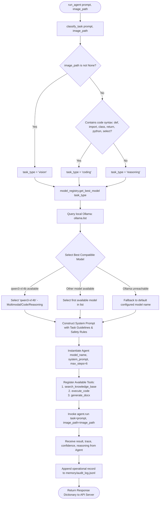

#### 15.3.4 `core/agent.py` — Autonomous ReAct Deliberation Loop

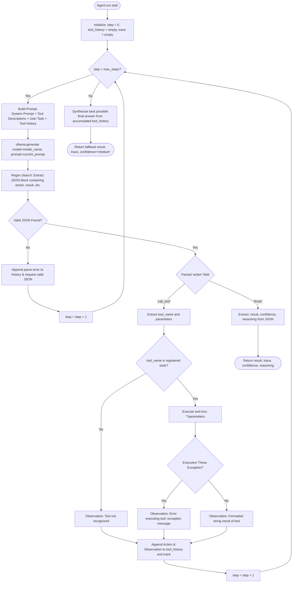

#### 15.3.5 `core/rag.py` — Vector Ingestion & Similarity Search Flowchart

```mermaid
flowchart TD
    subgraph Ingestion_Flow ["Text Ingestion Flow (ingest_text)"]
        ING_IN[Input: file_path, text, source_type] --> DB_INIT[init_db: Connect memory/workbench.db & load sqlite-vec]
        DB_INIT --> CHUNK_PROC[Split text into 500-char paragraphs with 100-char overlap]
        
        CHUNK_PROC --> CHUNK_LOOP{For Each Chunk}
        CHUNK_LOOP --> COMP_EMB[Compute 768-d Vector:\nTry Ollama nomic-embed-text -> If error, Deterministic Pseudo-Random Fallback]
        COMP_EMB --> SQL_CHUNK[INSERT INTO chunks: file_path, content, source_type, timestamp]
        SQL_CHUNK --> SQL_VEC[INSERT INTO vec_chunks rowid, embedding: 768-d float32 blob]
        SQL_VEC --> CHUNK_LOOP
        CHUNK_LOOP -->|All Chunks Processed| COMMIT[Commit SQLite Transaction & Close]
    end

    subgraph Query_Flow ["Similarity Search Flow (search)"]
        Q_IN[Input: query_str, top_k=3] --> Q_EMB[Generate 768-d Vector for query_str]
        Q_EMB --> VEC_SQL[Execute SQL Query:\nSELECT rowid, distance FROM vec_chunks\nWHERE embedding MATCH query_vector\nORDER BY distance LIMIT top_k]
        VEC_SQL --> JOIN_CHUNKS[JOIN with chunks table on chunks.id = vec_chunks.rowid]
        JOIN_CHUNKS --> COMP_SCORE[Calculate Score = 1.0 - distance]
        COMP_SCORE --> Q_OUT[Return List of SearchResult: content, file_path, score]
    end
```

#### 15.3.6 `core/sandbox.py` & `core/code_inspector.py` — Safe Code Execution Pipeline

```mermaid
flowchart TD
    CODE_IN[Input Python Code String] --> INSPECT[core/code_inspector.py: inspect_code]
    
    INSPECT --> AST_PARSE[ast.parse code_str]
    AST_PARSE --> AST_SYNTAX{Valid Python Syntax?}
    AST_SYNTAX -->|Syntax Error| SYN_REJ[Return SyntaxError detail]
    
    AST_SYNTAX -->|Parsed OK| NODE_WALK[Walk AST Nodes: ast.walk tree]
    NODE_WALK --> CHK_IMPORTS{Imports Blacklisted Module?\nsocket, requests, urllib, http, subprocess, os.system}
    CHK_IMPORTS -->|Yes| IMP_REJ[Return Security Violation: Blacklisted module import]
    
    CHK_IMPORTS -->|No| CHK_BUILTINS{Calls Forbidden Builtin?\neval, exec, __import__}
    CHK_BUILTINS -->|Yes| BLT_REJ[Return Security Violation: Forbidden builtin execution]
    
    CHK_BUILTINS -->|No| SAFE_OK[Code Approved by Inspector]
    
    SYN_REJ & IMP_REJ & BLT_REJ --> EXEC_BLOCKED[Return success=False, error=reason]
    
    SAFE_OK --> EXEC_SANDBOX[core/sandbox.py: execute_code]
    EXEC_SANDBOX --> MK_TEMP[Create isolated temporary working directory]
    MK_TEMP --> WRITE_PY[Write code to temp_script.py inside temp directory]
    
    WRITE_PY --> PLATFORM_CHK{Host OS}
    PLATFORM_CHK -->|Linux / POSIX| APPLY_LIMITS[Configure preexec_fn with resource.setrlimit: CPU=5s, RAM=256MB]
    PLATFORM_CHK -->|Windows (NT)| GUARD_LIMITS[Set preexec_fn = None to prevent Windows crash]
    
    APPLY_LIMITS & GUARD_LIMITS --> SPAWN_PROC[subprocess.Popen sys.executable, temp_script.py, timeout=15s]
    SPAWN_PROC --> CAPTURE_IO[Capture stdout, stderr, execution elapsed time]
    CAPTURE_IO --> CLEAN_TEMP[Remove temporary script & directory]
    CLEAN_TEMP --> EXEC_RES[Return ExecutionResult: stdout, stderr, exit_code, exec_time]
```

#### 15.3.7 `core/doc_gen.py` — Report Generation Pipeline Flowchart

```mermaid
flowchart TD
    DOC_IN[Input: title, markdown_content, output_filename] --> OUT_PATH[Resolve Destination: data/reports/output_filename.docx]
    
    OUT_PATH --> CHECK_PANDOC{Is 'pandoc' installed in System PATH?}
    
    %% Pandoc Branch
    CHECK_PANDOC -->|Yes| WRITE_MD[Write temporary markdown file]
    WRITE_MD --> RUN_PANDOC[Execute: pandoc temp.md -o output.docx]
    RUN_PANDOC --> PANDOC_OK{Pandoc Succeeded?}
    PANDOC_OK -->|Yes| CLEAN_MD[Delete temporary markdown file] --> REGISTER_CATALOG
    PANDOC_OK -->|No| FALLBACK_NATIVE[Fall Back to Native Generator]
    
    %% Native python-docx Fallback Branch
    CHECK_PANDOC -->|No| FALLBACK_NATIVE
    FALLBACK_NATIVE --> DOCX_INIT[Instantiate docx.Document]
    DOCX_INIT --> ADD_TITLE[Add Document Title Heading 0 & Subtitle]
    ADD_TITLE --> PARSE_LINES{Parse Markdown Lines}
    
    PARSE_LINES -->|Line starts with '# '| H1[doc.add_heading text, level=1]
    PARSE_LINES -->|Line starts with '## '| H2[doc.add_heading text, level=2]
    PARSE_LINES -->|Line starts with '### '| H3[doc.add_heading text, level=3]
    PARSE_LINES -->|Line starts with '* ' or '- '| BULLET[doc.add_paragraph text, style='List Bullet']
    PARSE_LINES -->|Standard Text Line| PARA[doc.add_paragraph text]
    
    H1 & H2 & H3 & BULLET & PARA --> SAVE_DOCX[doc.save target_path]
    SAVE_DOCX --> REGISTER_CATALOG
    
    %% Metadata Cataloging
    REGISTER_CATALOG --> READ_JSON[Read existing data/reports.json]
    READ_JSON --> APPEND_META[Append Record: id, name, file_path, size, date, summary]
    APPEND_META --> WRITE_JSON[Save updated data/reports.json]
    WRITE_JSON --> DOC_OUT[Return Dictionary: {path, size, filename}]
```

#### 15.3.8 `OCR/file_processor.py` — Multi-Format File Extraction Flowchart

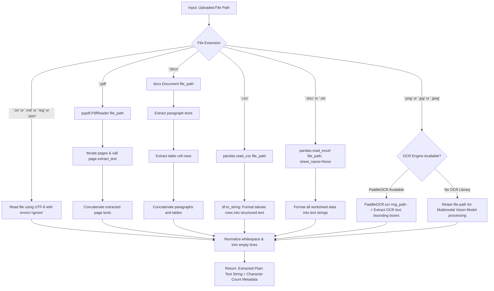

#### 15.3.9 `frontend/js/` — Client State, Auth & Dispatch Flowchart

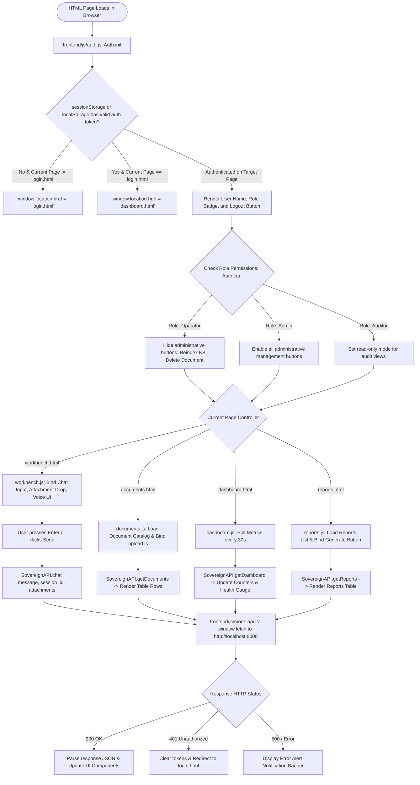

---

### 15.4 Diagram 1 — High-Level System Architecture

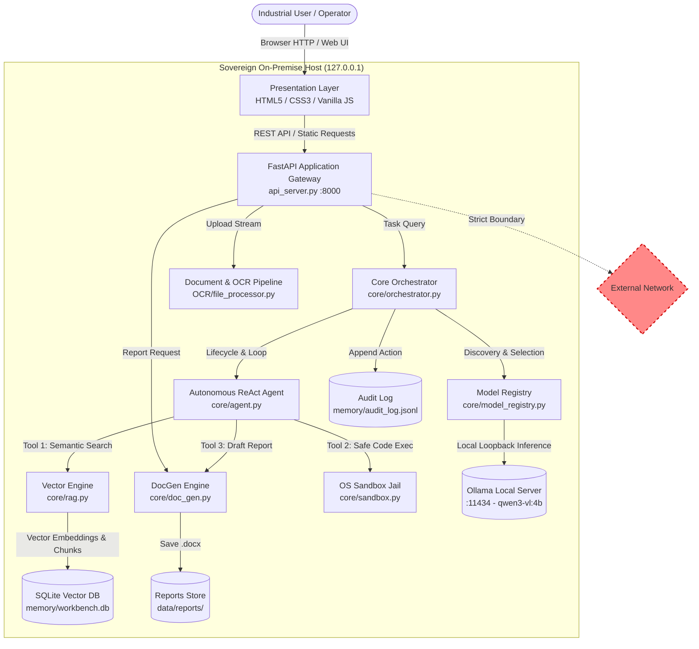

---

### 15.5 Diagram 2 — Frontend ↔ Backend Architecture

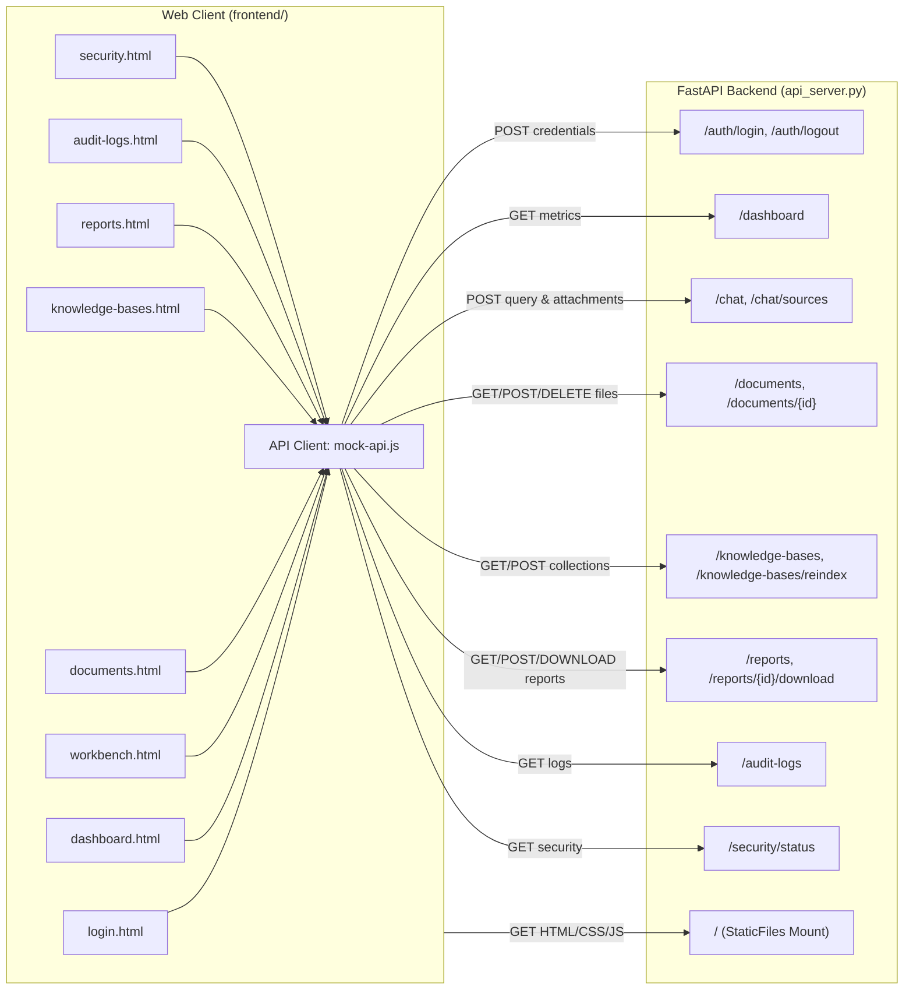

---

### 15.6 Diagram 3 — End-to-End User Interaction Sequence

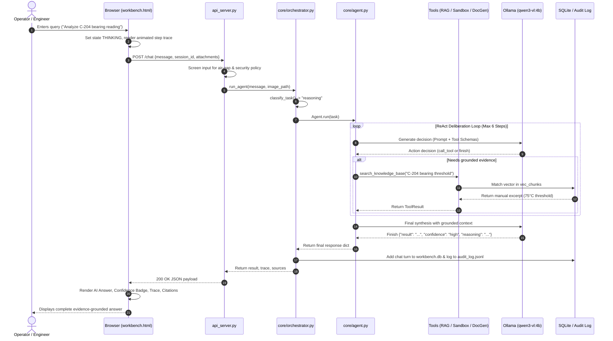

---

### 15.7 Diagram 4 — File Upload & Ingestion Pipeline

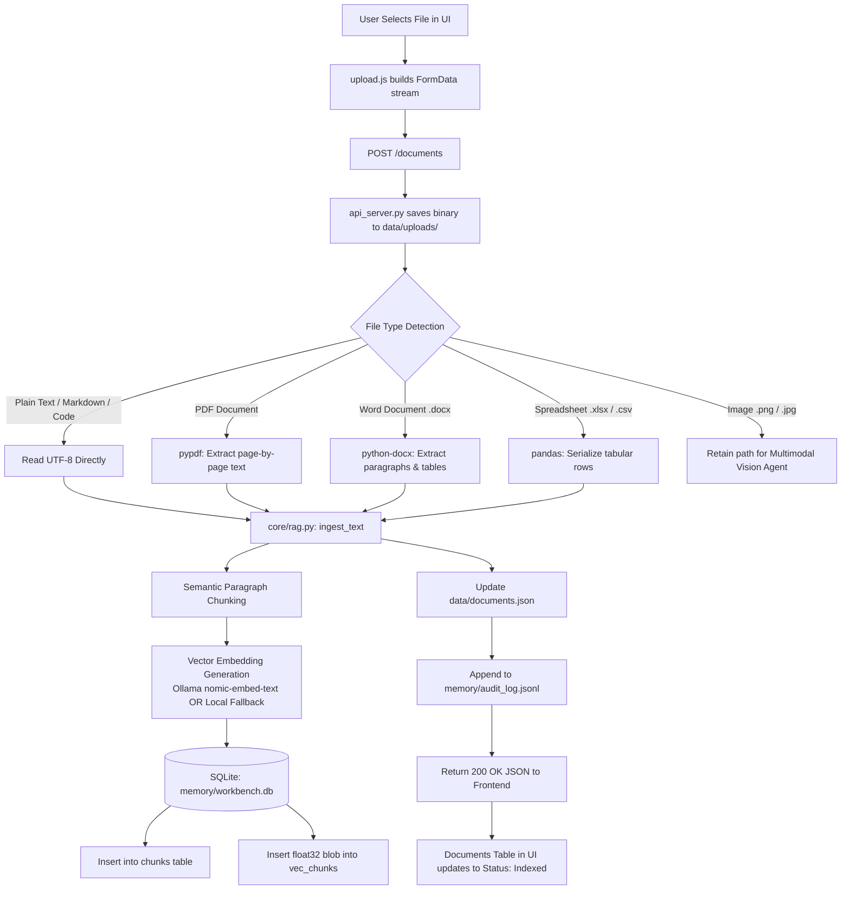

---

### 15.8 Diagram 5 — AI Agent Routing & Execution Loop

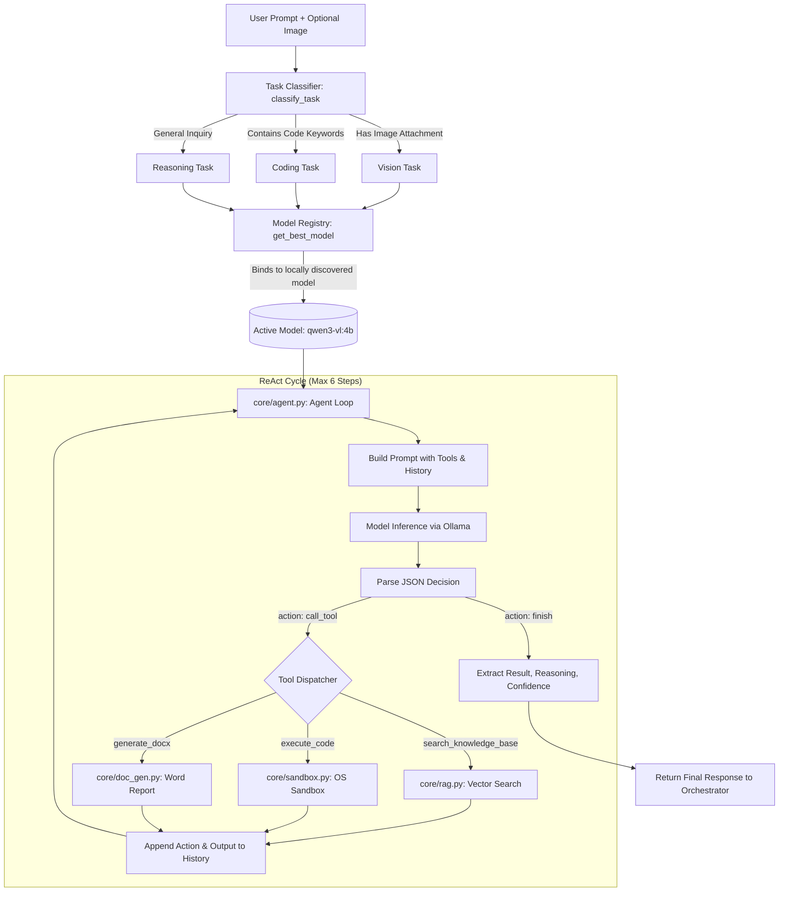

---

### 15.9 Diagram 6 — OCR & Multi-Format Parsing Pipeline

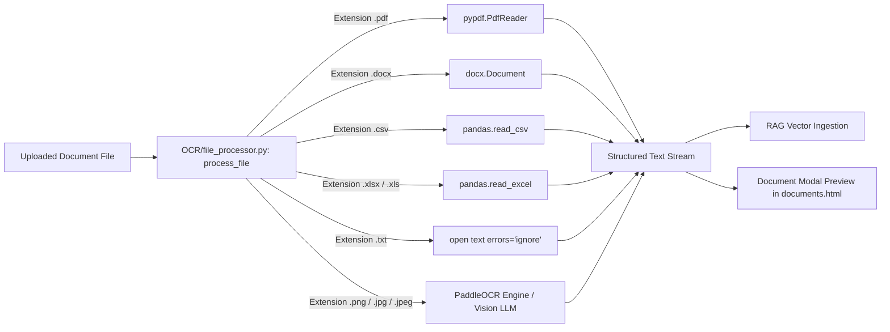

---

### 15.10 Diagram 7 — Deployment & Air-Gap Topology

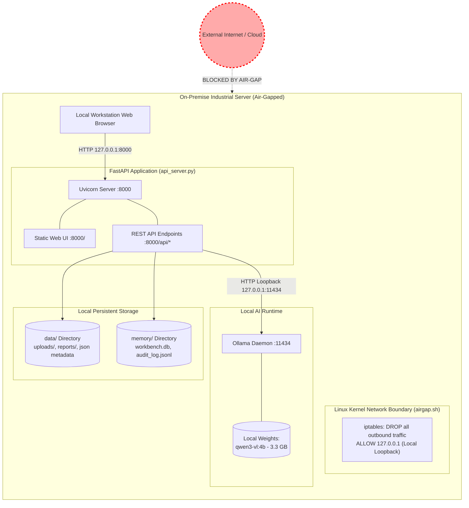

---

## 16. Known Gaps & Future Roadmap

To ensure technical integrity, the following architectural aspects represent current boundaries and future engineering targets:

1. **Multi-User Concurrency for File Uploads:**
   * *Current State:* The in-memory map `_uploaded_files` in `api_server.py` maps filenames to saved paths. In a single-operator workstation environment, this functions smoothly; in a multi-tenant enterprise deployment, this should be keyed by a tenant or session identifier.
2. **Streaming Server-Sent Events (SSE) for Real-Time LLM Tokens:**
   * *Current State:* `api_server.py` returns the complete ReAct agent trace and result as a synchronous HTTP POST response once inference finishes. The frontend displays animated progress steps while waiting. Integrating SSE (`EventSource`) or WebSockets will allow token-by-token streaming.
3. **Hardware Acceleration Compatibility:**
   * *Current State:* The local inference engine (`qwen3-vl:4b`) runs via Ollama, utilizing CPU or GPU (CUDA/ROCm) when host drivers are configured. On Windows hosts lacking dedicated GPUs, multi-step ReAct loops may take 15–30 seconds per query.
4. **Dedicated Embedding Model Synchronization:**
   * *Current State:* If `nomic-embed-text` is not pulled locally, the vector engine falls back to a deterministic 768-dimensional local vector generator. While this ensures zero failure under complete air-gap conditions, pulling `nomic-embed-text` improves semantic nuance for multi-paragraph document queries.

---

### Verification Note
This architecture document reflects the active code in `Master/`. All documented endpoints, modules, parameters, tools, and workflows exist in the current codebase.
