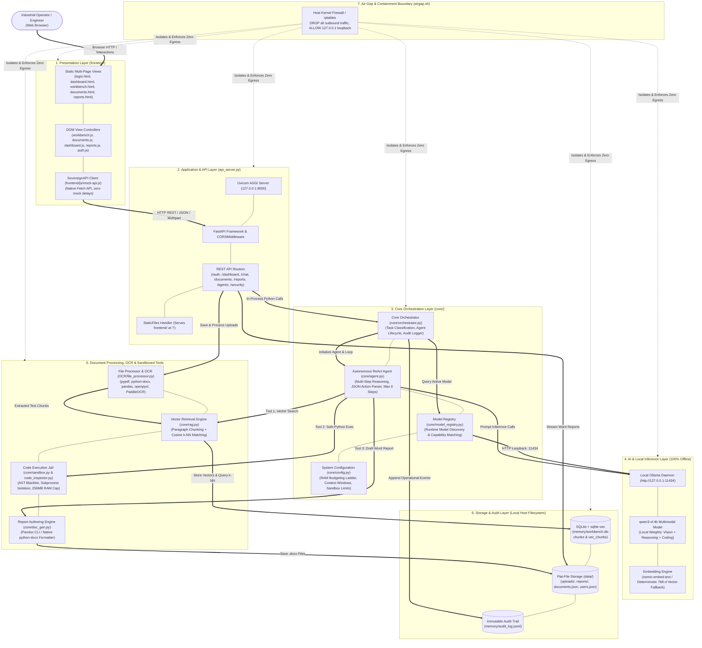
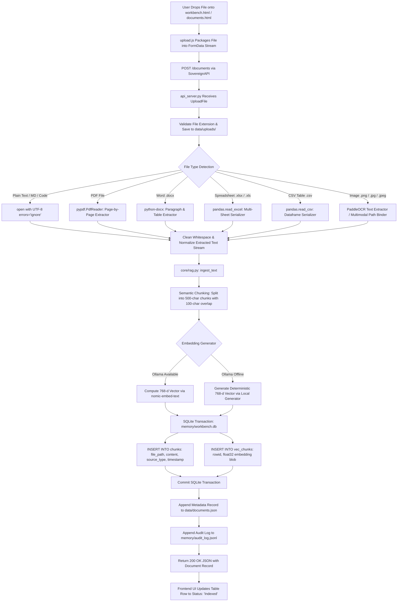
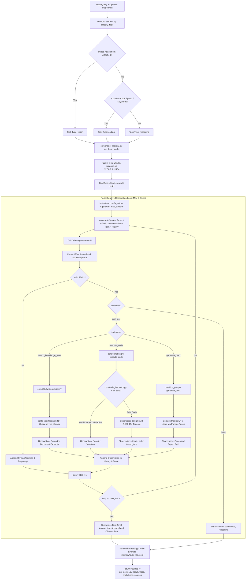
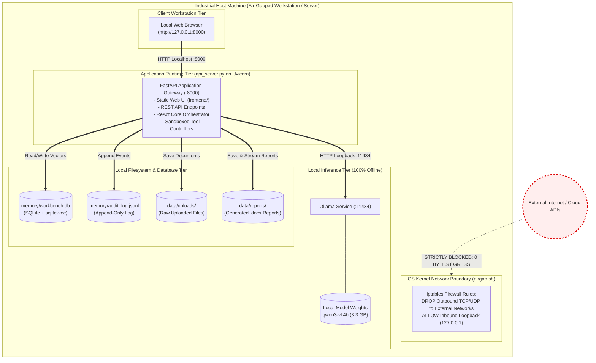
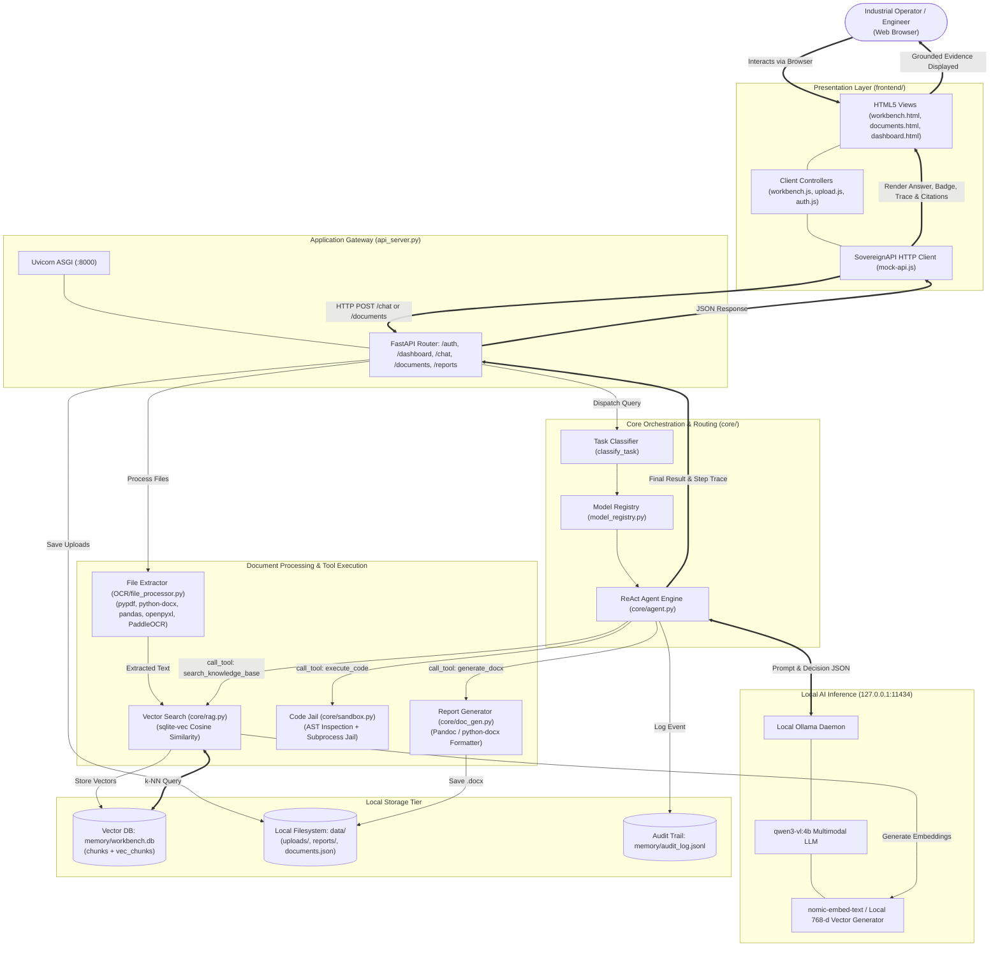

# 🔒 Sovereign AI Workbench
# System Architecture & Workflow Document

> **Project:** Smart India Hackathon (SIH) 2026 — Problem Statement 26117  
> **Target Environment:** On-Premise, Air-Gapped Industrial Facility (Refinery / Critical Infrastructure)  
> **System Nature:** 100% Self-Hosted, Zero-Egress Agentic AI Workbench  
> **File:** `flowchart.md`  
> **Audience:** Technical Reviewers, Hackathon Judges, Academic Evaluators, and Engineers  

---

## 1. System Overview

### 1.1 What the System Does
The **Sovereign AI Workbench** is an on-premise, zero-egress artificial intelligence platform designed to operate within strictly air-gapped industrial control systems. It allows plant engineers and operators to query technical documentation, verify operating thresholds against standard operating procedures (SOPs), ingest and parse multi-format documents (PDFs, Word documents, Excel spreadsheets, CSVs, and images), execute Python code inside a security jail, and generate publication-grade technical Word reports (`.docx`) without transmitting any data over external networks.

### 1.2 Main Purpose
* **Zero Data Exfiltration (Air-Gapped Privacy):** Enforces a strict 0-byte outbound network egress policy to protect confidential industrial blueprints and operational data.
* **Autonomous Task Solving:** Employs an iterative ReAct (Reasoning + Acting) autonomous agent capable of selecting and running specialized local tools.
* **Industrial Document Intelligence:** Combines local vector search (RAG) and multi-format extraction/OCR to transform static plant manuals into queryable knowledge.

### 1.3 Major Components
1. **Presentation Layer:** Lightweight multi-page web application (`frontend/`) written in semantic HTML5, Vanilla CSS, and modern JavaScript.
2. **Gateway & API Server:** High-performance asynchronous REST API (`api_server.py`) built on FastAPI and served via Uvicorn.
3. **Core Orchestration & Agent Engine:** Task classifier, runtime model registry, and autonomous ReAct agent loop (`core/orchestrator.py`, `core/agent.py`, `core/model_registry.py`).
4. **Local AI Inference Engine:** 100% offline model server (Ollama daemon on `127.0.0.1:11434`) executing the `qwen3-vl:4b` multimodal vision-language model.
5. **Tooling & Document Processing:** Semantic vector retrieval with `sqlite-vec` (`core/rag.py`), sandboxed Python execution jail (`core/sandbox.py`), automated report authoring (`core/doc_gen.py`), and multi-format document parsers (`OCR/file_processor.py`).
6. **Local Persistence & Audit:** SQLite vector database (`memory/workbench.db`), file-based metadata catalogs (`data/`), and append-only audit trail (`memory/audit_log.jsonl`).

### 1.4 Overall Working Concept
The operator accesses the application locally via a web browser. When a question or file is submitted, the FastAPI gateway routes it to the Core Orchestrator. The orchestrator classifies the task, binds the request to the local `qwen3-vl:4b` model, and initiates an autonomous agent loop. The agent reasons about the query, executes local tools (semantic vector search, code calculation, or report generation) if evidence is required, synthesizes a grounded response, updates the immutable audit log, and returns the verified answer with step-by-step reasoning traces and source citations to the user interface.

---

## 2. System Architecture

The system follows an 8-layer decoupled architecture engineered for local execution without external cloud dependencies:

```text
User (Industrial Operator / Engineer)
  ↓
Frontend / User Interface Layer (frontend/*.html, modern Vanilla CSS, ES6 JS Controllers)
  ↓
Application / API Layer (api_server.py — FastAPI on Uvicorn ASGI :8000)
  ↓
Core Processing / Orchestration Layer (core/orchestrator.py, core/agent.py, core/model_registry.py)
  ↓
AI / Agent / Model Layer (Ollama Server :11434 — qwen3-vl:4b, nomic-embed-text / local 768-d fallback)
  ↓
OCR / Document Processing / Tools (OCR/file_processor.py, core/rag.py, core/sandbox.py, core/doc_gen.py)
  ↓
Storage / Output Layer (memory/workbench.db [sqlite-vec], data/uploads/, data/reports/, memory/audit_log.jsonl)
  ↓
User (Rendered answer, confidence score, step trace, and source citations in workbench.html)
```

### Component Details

#### 1. Presentation Layer (`frontend/`)
* **Component Name:** Web Client Interface (`login.html`, `dashboard.html`, `workbench.html`, `documents.html`, `reports.html`, `mock-api.js`)
* **Purpose:** Provides a responsive, accessible interface for industrial operators.
* **Main Responsibility:** Accepts user input, manages drag-and-drop file uploads, displays real-time thinking states, renders step execution traces, and enforces client-side role-based access control (RBAC).
* **Input:** User keystrokes, uploaded document files, session interaction events.
* **Output:** HTTP REST requests (`application/json`, `multipart/form-data`) dispatched via `SovereignAPI` (`frontend/js/mock-api.js`).
* **Connection:** Communicates exclusively with `api_server.py` over HTTP port 8000.

#### 2. Application & API Layer (`api_server.py`)
* **Component Name:** Unified API Gateway (`api_server.py`)
* **Purpose:** Central application gateway hosting the REST API and serving frontend assets.
* **Main Responsibility:** Validates HTTP requests, handles session authentication, manages file persistence to disk, routes chat queries to the orchestrator, and returns structured JSON responses.
* **Input:** HTTP REST requests from frontend client.
* **Output:** JSON payloads, file streams (`FileResponse`), static web assets (HTML/CSS/JS).
* **Connection:** Serves `frontend/`, dispatches tasks to `core/orchestrator.py`, routes uploads to `OCR/file_processor.py` and `core/rag.py`, and streams documents from `data/reports/`.

#### 3. Core Processing & Orchestration Layer (`core/orchestrator.py`, `core/model_registry.py`)
* **Component Name:** Core Task Orchestrator & Model Registry
* **Purpose:** Manages the cognitive lifecycle of tasks and dynamically discovers available local models.
* **Main Responsibility:** Classifies queries (`vision`, `coding`, `reasoning`), binds appropriate local models via `core/model_registry.py`, registers authorized tools, instantiates the ReAct agent, and records tamper-evident audit logs.
* **Input:** User prompt, optional image path, session identifier, persona configuration.
* **Output:** Structured dictionary containing final answer, reasoning trace, confidence level, and source citations.
* **Connection:** Invoked by `api_server.py`; coordinates with `core/agent.py`, `core/model_registry.py`, `core/rag.py`, `core/sandbox.py`, and `core/doc_gen.py`.

#### 4. AI & Agent Execution Engine (`core/agent.py`)
* **Component Name:** Autonomous ReAct Agent Loop
* **Purpose:** Executes iterative multi-step reasoning and tool dispatching until a task is completed.
* **Main Responsibility:** Formats prompt templates with tool schemas, invokes the local LLM, parses structured JSON decisions (`call_tool` vs. `finish`), executes requested tools, appends observations, and enforces a maximum step limit (`max_steps=6`).
* **Input:** Task prompt, tool definitions, execution history.
* **Output:** Final parsed result dictionary (`result`, `reasoning`, `confidence`, `trace`).
* **Connection:** Invoked by `core/orchestrator.py`; sends inference requests to local Ollama daemon; calls registered tool functions.

#### 5. Local Model & Inference Engine (Ollama Daemon)
* **Component Name:** Local Ollama Inference Server (`http://127.0.0.1:11434`)
* **Purpose:** Delivers fully offline LLM inference and embedding computations with zero cloud telemetry.
* **Main Responsibility:** Hosts local model weights (`qwen3-vl:4b` multimodal 3.3 GB model) and computes vector embeddings (`nomic-embed-text` or deterministic local 768-d vector fallback).
* **Input:** Prompt text strings, parameter configurations, image file paths.
* **Output:** Generated completion text and raw embedding float vectors.
* **Connection:** Receives loopback HTTP calls from `core/agent.py`, `core/model_registry.py`, and `core/rag.py`.

#### 6. Document Processing & OCR Layer (`OCR/file_processor.py`, `OCR/document_pipeline.py`)
* **Component Name:** Multi-Format Extraction & OCR Pipeline
* **Purpose:** Extracts plain text and tabular data from heterogeneous industrial file formats.
* **Main Responsibility:** Parses digital PDFs (`pypdf`), Word documents (`python-docx`), spreadsheets (`pandas`, `openpyxl`), plain text files, and images (`PaddleOCR` / vision model).
* **Input:** Raw binary files stored in `data/uploads/`.
* **Output:** Clean, structured text streams with page/sheet markers.
* **Connection:** Called by `api_server.py` upon file upload; feeds extracted text to `core/rag.py`.

#### 7. Tooling & Execution Layer (`core/rag.py`, `core/sandbox.py`, `core/doc_gen.py`)
* **Component Name:** Sandboxed Tool Ecosystem
* **Purpose:** Provides grounded factual knowledge, isolated code execution, and automated report generation.
* **Main Responsibility:**
  * `core/rag.py`: Performs paragraph chunking, computes 768-d vector embeddings, and executes cosine k-NN vector queries via `sqlite-vec`.
  * `core/sandbox.py` & `core/code_inspector.py`: Validates Python syntax using AST inspection to block prohibited modules/builtins and executes scripts inside an OS-confined temporary jail with strict CPU and memory limits.
  * `core/doc_gen.py`: Transforms Markdown analysis into formatted Word `.docx` documents via Pandoc or native `python-docx` fallback.
* **Input:** Tool parameters (search query string, Python code string, report Markdown text).
* **Output:** Tool execution observations (text excerpts, stdout/stderr, generated report file path).
* **Connection:** Dispatched by `core/agent.py`; writes to `data/reports/` and reads/writes to `memory/workbench.db`.

#### 8. Local Storage & Persistence Layer (`memory/`, `data/`)
* **Component Name:** Local Database & Flat-File Storage
* **Purpose:** Maintains persistent state, vector embeddings, documents, reports, and audit trails.
* **Main Responsibility:** Stores document chunks and vectors in `memory/workbench.db` (SQLite + `sqlite-vec`), saves raw files in `data/uploads/`, catalogs reports in `data/reports.json`, and records immutable system events in `memory/audit_log.jsonl`.
* **Input:** Document chunks, embeddings, binary uploads, audit log entries.
* **Output:** Vector search matches, saved file paths, metadata records.
* **Connection:** Accessed by `api_server.py`, `core/rag.py`, `core/doc_gen.py`, and `core/orchestrator.py`.

---

## 3. Architecture Diagram

The diagram below illustrates the layered technical architecture, showing components, data pathways, and isolation boundaries:



---

## 4. Detailed Component Architecture

| Component | Responsibility | Input | Output | Connected To |
|:---|:---|:---|:---|:---|
| **Presentation UI** (`frontend/`) | Renders web views, captures user actions, displays step traces, formatted responses, and citations. | User keyboard/mouse input, API JSON payloads. | DOM mutations, user events. | `frontend/js/mock-api.js` |
| **API Client (`mock-api.js`)** | Abstracts HTTP client requests using native `fetch()` without artificial delays. | JavaScript function parameters (credentials, messages, FormData). | HTTP Promises resolving to response data. | `api_server.py` |
| **API Server (`api_server.py`)** | Hosts REST API, authenticates users, receives file uploads, coordinates chat routing, serves static UI. | HTTP Requests (JSON, query params, multipart streams). | HTTP Responses (JSON, binary file streams, static HTML/CSS/JS). | `frontend/`, `core/orchestrator.py`, `OCR/file_processor.py`, `core/rag.py` |
| **Core Orchestrator (`core/orchestrator.py`)** | Classifies incoming tasks, selects active models, manages agent execution, and records audit logs. | Prompt string, optional image path, session metadata. | Response dictionary (`result`, `reasoning`, `confidence`, `trace`, `sources`). | `api_server.py`, `core/agent.py`, `core/model_registry.py`, `memory/audit_log.jsonl` |
| **Model Registry (`core/model_registry.py`)** | Discovers locally installed Ollama models and maps requested capabilities to best available model. | Capability query (`vision`, `coding`, `reasoning`, `general`). | Selected model name string (`qwen3-vl:4b`) or fallback warning. | `Ollama` daemon (`127.0.0.1:11434`), `core/orchestrator.py` |
| **ReAct Agent Engine (`core/agent.py`)** | Executes iterative multi-step reasoning, tool dispatching, observation handling, and loop termination. | Task string, registered tool list, maximum steps (`max_steps=6`). | Parsed completion dictionary (`result`, `reasoning`, `confidence`, `trace`). | `core/orchestrator.py`, `Ollama`, registered Tool functions |
| **Local Inference Server (`Ollama`)** | Runs local LLM weights offline for reasoning, multimodal vision, and embedding generation. | Prompt text strings, parameter configurations, image inputs. | Raw text completions and 768-d float embeddings. | `core/agent.py`, `core/model_registry.py`, `core/rag.py` |
| **RAG & Vector Memory (`core/rag.py`)** | Chunks text, computes embeddings, and performs vector k-NN similarity searches. | Document text, search queries, k-NN limits. | Extracted chunk counts, ranked passage results with similarity scores. | `memory/workbench.db` (sqlite-vec), `Ollama`, `core/agent.py` |
| **File Processor & OCR (`OCR/file_processor.py`)** | Extracts text and tables from PDFs, DOCX, CSVs, Excel files, and images. | Binary document paths from `data/uploads/`. | Clean extracted text string with page/sheet demarcations. | `pypdf`, `python-docx`, `pandas`, `PaddleOCR`, `core/rag.py` |
| **Sandbox Execution (`core/sandbox.py`)** | Runs Python code inside a security jail with AST inspection, RAM caps, and execution timeouts. | Python code string. | Execution result dictionary (`success`, `output`, `error`, `exec_time`). | `core/code_inspector.py`, Python subprocess |
| **Code Inspector (`core/code_inspector.py`)** | Analyzes Python AST to block blacklisted imports (`socket`, `os`, `subprocess`) and dangerous builtins. | Python code string. | Safety validation boolean and violation reason. | `core/sandbox.py` |
| **Report Generator (`core/doc_gen.py`)** | Transforms Markdown text into styled Word `.docx` documents. | Document title and Markdown content string. | Result dictionary with generated `.docx` file path and file size. | `Pandoc` CLI, `python-docx`, `data/reports/`, `data/reports.json` |
| **System Launcher (`start.py`)** | Verifies Python environment, tests Ollama connection, checks `qwen3-vl:4b`, launches Uvicorn server. | Command-line invocation (`python start.py`). | Running Uvicorn server on port 8000 and opened browser window. | Host OS, `Uvicorn`, `Ollama` |

---

## 5. End-to-End Workflow

The complete operational lifecycle from system startup to final user response proceeds through the following sequential stages:

```text
Application Start
  → System Initialization
  → Frontend Loading
  → User Authentication
  → User Request Submission
  → Request Validation & Security Screening
  → Task Classification & Model Selection
  → Autonomous ReAct Agent Loop & Tool Execution
  → Memory Persistence & Audit Logging
  → Response Formatting & UI Visualization
  → User Review
```

### Step-by-Step Execution Details

#### Stage 1: Application Start
* **What Happens:** The administrator or operator boots the workbench via `python start.py`.
* **Component:** `start.py`
* **Input:** System execution command.
* **Output:** Verified execution environment, running ASGI server on `http://127.0.0.1:8000`.
* **Next Step:** System Initialization.

#### Stage 2: System Initialization
* **What Happens:** `start.py` checks Python version (>= 3.10), verifies directories (`data/uploads/`, `data/reports/`, `memory/`), probes local Ollama on `127.0.0.1:11434`, verifies `qwen3-vl:4b` availability, mounts static files, and launches Uvicorn.
* **Component:** `start.py`, `api_server.py`
* **Input:** Configuration paths and host environment parameters.
* **Output:** Listening FastAPI application gateway on port 8000.
* **Next Step:** Frontend Loading.

#### Stage 3: Frontend Loading & Authentication
* **What Happens:** User workstation navigates to `http://127.0.0.1:8000/`. `index.html` checks `sessionStorage` for an active auth token. If unauthenticated, routes to `login.html`. Operator enters credentials; `POST /auth/login` verifies against `data/users.json` and issues a session token.
* **Component:** `frontend/index.html`, `frontend/js/auth.js`, `api_server.py`
* **Input:** Username and password.
* **Output:** User session object and authentication token stored in `sessionStorage`.
* **Next Step:** User Request Submission.

#### Stage 4: User Request Submission
* **What Happens:** Operator navigates to `workbench.html`, types a technical inquiry (e.g., *"Analyze bearing temperature on Unit C-204 against manual limits"*), optionally attaches a file/image, and clicks Send.
* **Component:** `frontend/js/workbench.js`, `frontend/js/mock-api.js`
* **Input:** Text prompt string and optional attachment references.
* **Output:** `POST /chat` HTTP request payload `{message, session_id, attachments}`.
* **Next Step:** Request Processing & Security Screening.

#### Stage 5: Request Processing & Security Screening
* **What Happens:** `api_server.py` receives the request, sets UI state to `THINKING`, scans prompt against security rules for exfiltration patterns, and forwards the task to `core/orchestrator.py`.
* **Component:** `api_server.py`
* **Input:** Chat payload dictionary.
* **Output:** Validated task parameters.
* **Next Step:** Task Classification & Model Selection.

#### Stage 6: Task Classification & Model Selection
* **What Happens:** `core/orchestrator.py` invokes `classify_task()`. It checks if media attachments exist (routes to `vision`), if code keywords exist (routes to `coding`), or defaults to `reasoning`. `core/model_registry.py` verifies local model availability and binds `qwen3-vl:4b`.
* **Component:** `core/orchestrator.py`, `core/model_registry.py`
* **Input:** Prompt string and attachment paths.
* **Output:** Task classification label and resolved model identifier.
* **Next Step:** Autonomous ReAct Agent Loop.

#### Stage 7: Autonomous ReAct Agent Loop & Tool Execution
* **What Happens:** `core/agent.py` constructs a prompt containing tool descriptions and task instructions. It invokes `ollama.generate()` locally. The LLM returns a structured JSON action:
  * If action is `call_tool`, it executes the tool (`search_knowledge_base`, `execute_code`, or `generate_docx`), captures the observation, appends it to history, and iterates (up to 6 steps).
  * If action is `finish`, it extracts the final result, reasoning, and confidence score.
* **Component:** `core/agent.py`, `core/rag.py`, `core/sandbox.py`, `core/doc_gen.py`, `Ollama`
* **Input:** ReAct system prompt, tool definitions, accumulated observations.
* **Output:** Structured dictionary `{result, reasoning, confidence, trace, sources}`.
* **Next Step:** Memory Persistence & Audit Logging.

#### Stage 8: Memory Persistence & Audit Logging
* **What Happens:** The interaction turn is committed to `memory/workbench.db`. An append-only audit event record containing timestamp, user, prompt, classification, tool trace, and status is logged to `memory/audit_log.jsonl`.
* **Component:** `core/orchestrator.py`, `core/memory_manager.py`
* **Input:** Completed agent execution dictionary.
* **Output:** Persistent SQLite records and append-only audit line.
* **Next Step:** Response Generation & UI Visualization.

#### Stage 9: Response Generation & UI Visualization
* **What Happens:** `api_server.py` serializes the response as JSON (HTTP 200 OK). `workbench.js` removes the loading spinner, renders the markdown answer, updates the confidence badge (`HIGH`), populates the step-by-step trace accordion, and lists clickable source citation chips.
* **Component:** `api_server.py`, `frontend/js/workbench.js`, `frontend/js/trace.js`
* **Input:** Backend HTTP JSON response.
* **Output:** Interactive visual response displayed in the operator's web browser.
* **Next Step:** User Review (Workflow Completed).

---

## 6. Master End-to-End Workflow Diagram

```mermaid
flowchart TD
    START([System Boot: python start.py]) --> BOOT_CHECK{Prerequisites & Model Verified?}
    BOOT_CHECK -->|No| BOOT_ERR[Display Warning / Setup Guidance] --> BOOT_HALT([Server Offline])
    BOOT_CHECK -->|Yes| LAUNCH_UVI[Launch Uvicorn on 127.0.0.1:8000]
    
    LAUNCH_UVI --> CLIENT_OPEN[Browser Opens http://127.0.0.1:8000]
    CLIENT_OPEN --> AUTH_CHECK{Active Session Token?}
    
    AUTH_CHECK -->|No| RENDER_LOGIN[Render login.html]
    RENDER_LOGIN --> DO_LOGIN[User Enters Credentials -> POST /auth/login]
    DO_LOGIN --> CHECK_USERS{Valid in data/users.json?}
    CHECK_USERS -->|No| LOGIN_FAIL[Show Error: Invalid Credentials] --> RENDER_LOGIN
    CHECK_USERS -->|Yes| SAVE_TOKEN[Save Token in sessionStorage] --> GOTO_APP[Load dashboard.html / workbench.html]
    
    AUTH_CHECK -->|Yes| GOTO_APP
    
    GOTO_APP --> USER_ACTION{User Action}
    
    %% Branch A: File Upload
    USER_ACTION -->|Upload File| UPLOAD_PAGE[Navigate to documents.html]
    UPLOAD_PAGE --> POST_FILE[POST /documents Multipart Stream]
    POST_FILE --> SAVE_UPLOAD[Save file binary to data/uploads/]
    SAVE_UPLOAD --> FILE_TYPE_CHK{File Extension}
    FILE_TYPE_CHK -->|PDF| EXT_PDF[pypdf: Extract Page Text]
    FILE_TYPE_CHK -->|DOCX| EXT_DOCX[python-docx: Extract Paragraphs]
    FILE_TYPE_CHK -->|XLSX / CSV| EXT_TABLE[pandas: Serialize Table Rows]
    FILE_TYPE_CHK -->|TXT / MD| EXT_TXT[UTF-8 Plain Text Reader]
    FILE_TYPE_CHK -->|Image| EXT_IMG[PaddleOCR / Vision Pipeline]
    
    EXT_PDF & EXT_DOCX & EXT_TABLE & EXT_TXT & EXT_IMG --> CHUNK_VEC[core/rag.py: Paragraph Chunking & 768-d Vector Embedding]
    CHUNK_VEC --> DB_COMMIT[Insert into memory/workbench.db chunks + vec_chunks]
    DB_COMMIT --> UPDATE_CATALOG[Update data/documents.json & memory/audit_log.jsonl]
    UPDATE_CATALOG --> REFRESH_DOCS_UI[UI Displays Document Status: Indexed]
    
    %% Branch B: Technical Query
    USER_ACTION -->|Submit Query| CHAT_INPUT[User Enters Prompt in workbench.html]
    CHAT_INPUT --> POST_CHAT[POST /chat payload: {message, session_id, attachments}]
    POST_CHAT --> CLASSIFY_TASK[core/orchestrator.py: classify_task]
    
    CLASSIFY_TASK --> TASK_DECISION{Task Intent}
    TASK_DECISION -->|Attachment Present| TASK_VISION[task_type: vision]
    TASK_DECISION -->|Code Keywords Detected| TASK_CODE[task_type: coding]
    TASK_DECISION -->|General Question| TASK_REASON[task_type: reasoning]
    
    TASK_VISION & TASK_CODE & TASK_REASON --> RESOLVE_MODEL[core/model_registry.py: Bind qwen3-vl:4b]
    RESOLVE_MODEL --> AGENT_EXEC[Instantiate core/agent.py: max_steps=6]
    
    subgraph REACT_LOOP ["Autonomous ReAct Agent Loop"]
        AGENT_EXEC --> BUILD_PROMPT[Construct System Prompt + Tool Schemas + History]
        BUILD_PROMPT --> CALL_OLLAMA[Local Inference: POST http://127.0.0.1:11434/api/generate]
        CALL_OLLAMA --> PARSE_ACT[Regex / JSON Action Parsing]
        PARSE_ACT --> ACTION_CHECK{Action Type}
        
        ACTION_CHECK -->|call_tool| SELECT_TOOL{Tool Requested}
        SELECT_TOOL -->|search_knowledge_base| RUN_RAG[core/rag.py: sqlite-vec Cosine Search]
        SELECT_TOOL -->|execute_code| RUN_CODE[core/sandbox.py: AST Inspection & Subprocess Jail]
        SELECT_TOOL -->|generate_docx| RUN_DOC[core/doc_gen.py: Compile Markdown to .docx]
        
        RUN_RAG & RUN_CODE & RUN_DOC --> APPEND_TRACE[Append Output to History & Increment Step]
        APPEND_TRACE --> STEP_LIMIT{step >= 6?}
        STEP_LIMIT -->|No| BUILD_PROMPT
        STEP_LIMIT -->|Yes| FORCED_SYNTH[Synthesize Best Answer from Trace]
        
        ACTION_CHECK -->|finish| EXTRACT_RESULT[Extract final result, reasoning, confidence]
    end
    
    FORCED_SYNTH & EXTRACT_RESULT --> LOG_AUDIT[core/orchestrator.py: Append Record to memory/audit_log.jsonl]
    LOG_AUDIT --> HTTP_RESP[api_server.py returns HTTP 200 OK JSON]
    HTTP_RESP --> UI_UPDATE[frontend/js/workbench.js Renders Answer, Confidence Badge, Trace & Citations]
    UI_UPDATE --> END([Operator Views Evidence-Grounded Response])
```

---

## 7. File Upload & Ingestion Workflow

### 7.1 Multi-Format Processing Strategy
The document subsystem parses heterogeneous industrial files into structured plain text, generates normalized embeddings, and indexes them into the local vector database:

* **PDF Documents (`.pdf`):** Processed via `pypdf.PdfReader`. Text is extracted page-by-page with page-number headers to preserve citation context.
* **Word Documents (`.docx`):** Processed via `python-docx.Document`. Iterates through all paragraphs and table cell contents to reconstruct document structure.
* **Spreadsheets (`.xlsx`, `.xls`):** Processed via `pandas.read_excel(..., sheet_name=None)`. Iterates across all worksheets and serializes structured grid rows into readable text.
* **Delimited Tables (`.csv`):** Processed via `pandas.read_csv()`. Serializes rows and columnar headings using `df.to_string()` for tabular semantic search.
* **Plain Text & Code (`.txt`, `.md`, `.log`, `.json`):** Read directly from disk using UTF-8 encoding with lenient error substitution (`errors='ignore'`).
* **Images (`.png`, `.jpg`, `.jpeg`):** Processed through `PaddleOCR` to detect text bounding boxes, or retained in `data/uploads/` as visual inputs for the multimodal vision agent (`qwen3-vl:4b`).

### 7.2 File Upload Diagram



---

## 8. AI / Agent Workflow

The system employs a dynamically routed ReAct (Reasoning + Acting) autonomous agent framework that decides at runtime whether to answer directly or invoke sandboxed tools.

### 8.1 Workflow Stages
1. **User Query Analysis:** The incoming prompt is analyzed for media attachments, programming keywords, or procedural terminology.
2. **Intent Routing & Model Selection:** `core/orchestrator.py` routes the task to `vision`, `coding`, or `reasoning`. `core/model_registry.py` matches the task to the local `qwen3-vl:4b` model.
3. **Prompt & Tool Synthesis:** The agent builds a system prompt embedding schemas for 3 available tools:
   * `search_knowledge_base(query)`: Queries `memory/workbench.db` using `sqlite-vec` cosine similarity.
   * `execute_code(code)`: Executes mathematical calculations or data transforms inside an AST-inspected temporary jail.
   * `generate_docx(title, content, filename)`: Compiles Markdown analysis into a styled Word report.
4. **Local LLM Inference:** The prompt is sent via HTTP loopback to `http://127.0.0.1:11434/api/generate`.
5. **Action Decision Extraction:** The agent parses the model's raw output via regex to extract a JSON action:
   * `{"action": "call_tool", "tool": "...", "arg": "..."}`
   * `{"action": "finish", "result": "...", "confidence": "high", "reasoning": "..."}`
6. **Tool Execution & Observation:** If a tool call is requested, the registered Python function runs, produces an observation string, appends it to the conversation history, and triggers the next deliberation step.
7. **Cycle Termination:** The loop terminates when the model outputs `finish`, or when the maximum threshold (`max_steps=6`) is reached.

### 8.2 AI / Agent Mermaid Diagram



---

## 9. Data Flow

The following table summarizes the data flowing across boundaries in the Sovereign AI Workbench:

| From (Source) | To (Destination) | Data Transferred | Purpose |
|:---|:---|:---|:---|
| **Operator Browser** | `api_server.py` | HTTP POST credentials (`username`, `password`) | User authentication and session token issuance. |
| **Operator Browser** | `api_server.py` | `multipart/form-data` binary file stream | Ingesting technical manuals, PDFs, spreadsheets, and images. |
| **`api_server.py`** | `data/uploads/` | Raw file byte stream | Persisting original uploaded files to disk. |
| **`api_server.py`** | `OCR/file_processor.py` | File path on disk | Initiating text and table extraction. |
| **`OCR/file_processor.py`** | `core/rag.py` | Extracted plain text string + metadata | Handing off extracted text for vector chunking. |
| **`core/rag.py`** | Local `Ollama` (:11434) | Text chunk string | Generating 768-dimensional vector embeddings. |
| **`core/rag.py`** | `memory/workbench.db` | Text chunks and binary vector blobs | Storing text in `chunks` and float vectors in `vec_chunks`. |
| **Operator Browser** | `api_server.py` | JSON payload `{message, session_id, attachments}` | Submitting a technical query to the AI agent. |
| **`api_server.py`** | `core/orchestrator.py` | Prompt string, image path, persona configuration | Routing query to the agentic orchestration engine. |
| **`core/orchestrator.py`** | `core/model_registry.py` | Task classification label (`vision`, `coding`, `reasoning`) | Resolving and binding the best compatible local model. |
| **`core/agent.py`** | Local `Ollama` (:11434) | Prompt string with tool definitions and history | Requesting LLM reasoning and decision synthesis. |
| **`core/agent.py`** | `core/rag.py` | Semantic search query string | Retrieving grounded technical SOP manual excerpts. |
| **`core/agent.py`** | `core/sandbox.py` | Python code snippet string | Safely executing calculations in an isolated jail. |
| **`core/agent.py`** | `core/doc_gen.py` | Report title, Markdown content string, filename | Generating publication-ready Word `.docx` technical reports. |
| **`core/orchestrator.py`** | `memory/audit_log.jsonl` | JSON event record (timestamp, user, prompt, trace) | Writing to the immutable, tamper-evident audit log. |
| **`api_server.py`** | Operator Browser | HTTP 200 OK JSON `{result, reasoning, confidence, trace, sources}` | Displaying verified response, badge, and citations in UI. |

---

## 10. Runtime & Deployment Architecture

### 10.1 Execution Environments

#### Mode 1: Native Unified Host Execution (Standard Hackathon / Workstation Setup)
* **Command:** `python start.py`
* **Process Lifecycle:** 
  1. `start.py` performs environment checks (Python version, Ollama daemon on `127.0.0.1:11434`, model availability).
  2. Spawns the Uvicorn ASGI server binding `127.0.0.1:8000`.
  3. Launches the default operating system browser pointing to `http://127.0.0.1:8000/`.
* **Ports Used:**
  * `8000`: FastAPI web server and static UI assets.
  * `11434`: Local Ollama inference daemon.
* **Storage Location:** All data is confined to local project folders (`data/` and `memory/`).

#### Mode 2: Hardened Docker Container Deployment
* **Command:** `python start_docker.py` or `docker compose up -d`
* **Configuration:** Defined in `Dockerfile` and `docker-compose.yml`.
* **Isolation:** The application container mounts host data volumes (`./data -> /app/data`, `./memory -> /app/memory`) while isolating the operating system kernel and filesystem.
* **Resource Caps:** Enforces RAM allocation budget (e.g., 40% system RAM).

#### Mode 3: Host Kernel Network Isolation (Strict Industrial Air-Gap)
* **Script:** `airgap.sh`
* **Mechanism:** Configures Linux kernel `iptables` rules to drop all outbound TCP and UDP packets across external network interfaces, allowing only local loopback traffic (`127.0.0.1`) between FastAPI and Ollama. This guarantees 0 Bytes outbound egress.

### 10.2 Deployment Topology Diagram



---

## 11. Complete Architecture + Workflow Diagram

The consolidated diagram below combines all layers, routing logic, tool executions, and data stores into a single end-to-end view suitable for presentations and technical reviews:



---

## 12. PPT-Ready Summary

### Architecture — 5 Key Points
1. **100% On-Premise Air-Gapped Topology:** Operates entirely within the host environment using a local FastAPI application server and a local Ollama inference daemon, guaranteeing 0 Bytes outbound egress.
2. **Lightweight Decoupled Presentation Layer:** Multi-page web client built with semantic HTML5, modern Vanilla CSS (dark mode), and modular JavaScript communicating with the backend via the clean `SovereignAPI` HTTP abstraction.
3. **Autonomous ReAct Agent Engine:** Uses an iterative Reasoning + Acting agent (`core/agent.py`) that analyzes tasks, calls sandboxed tools, observes outputs, and delivers evidence-backed answers within a maximum of 6 steps.
4. **Embedded Vector Database (`sqlite-vec`):** Replaces external vector services with an in-process SQLite vector extension storing 768-dimensional embeddings for grounded semantic document retrieval.
5. **Multi-Layered Security & Tamper-Evident Audit:** Features AST-inspected Python sandbox execution, memory/CPU resource caps, and an immutable append-only JSONL audit log of all system interactions.

### Workflow — 8 Key Steps
1. **Boot & Verify:** `python start.py` validates Python dependencies, checks local Ollama health, verifies `qwen3-vl:4b` weights, and launches Uvicorn on port 8000.
2. **Authenticate:** Operator enters credentials at `login.html`; backend validates against `data/users.json` and issues a session token.
3. **Ingest Documents:** Operator drops technical manuals into the dropzone; `OCR/file_processor.py` extracts text from PDFs, DOCX, CSVs, and Excel sheets, which `core/rag.py` chunks and indexes into `sqlite-vec`.
4. **Submit Inquiry:** Operator submits an operational question (with optional image) via `workbench.html`; UI updates to the "Thinking" state and initiates the live trace visualizer.
5. **Classify & Bind:** `core/orchestrator.py` classifies the task (`vision`, `coding`, or `reasoning`) and binds the local `qwen3-vl:4b` model via `core/model_registry.py`.
6. **Deliberate & Act:** The ReAct agent calls local tools as needed—querying vector memory for manual limits, executing Python scripts in an AST-inspected sandbox, or generating Word reports.
7. **Consolidate & Audit:** The interaction is recorded in session memory, and an immutable audit event is appended to `memory/audit_log.jsonl`.
8. **Render Response:** The frontend renders the formatted answer, confidence score badge (`HIGH`), collapsible step trace, and source citation chips.

### One-Line Explanation
> **"The system works by parsing industrial documents and engineering queries on-premise, using an autonomous local AI agent that retrieves verified manual excerpts and runs sandboxed calculations to deliver auditable, air-gapped answers without external internet access."**
